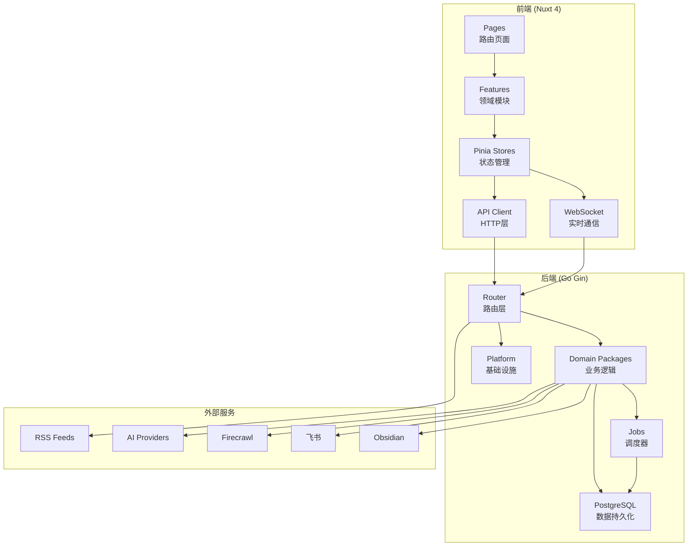

# 系统架构

**分析日期:** 2026-04-10

## 架构概览

**整体模式:** 前后端分离 + 领域驱动设计 (DDD)

**核心特征:**
- 前端 Nuxt 4 单页应用，后端 Go Gin REST API
- WebSocket 实时通信层
- PostgreSQL 数据持久化（近期从 SQLite 迁移）
- 多调度器异步任务处理
- OpenTelemetry 分布式追踪



## 分层架构

### 前端层级

**视图层 (Pages):**
- 位置: `front/app/pages/`
- 职责: 路由页面，保持薄层设计
- 依赖: Features 模块

**特性层 (Features):**
- 位置: `front/app/features/`
- 职责: 领域特定组件和业务逻辑
- 包含: `articles/`, `digest/`, `summaries/`, `topic-graph/`, `feeds/`, `ai/`, `shell/`
- 依赖: Stores 和 API Client

**状态层 (Stores):**
- 位置: `front/app/stores/`
- 主存储: `api.ts` (`useApiStore`) - 所有数据的主来源
- 衍生存储: `articles.ts`, `feeds.ts`, `preferences.ts`, `aiAnalysis.ts`
- 模式: Composition API + Pinia

**网络层 (API):**
- 位置: `front/app/api/`
- 核心类: `client.ts` (`ApiClient`)
- 返回格式: `{ success, data, error, message, pagination }`
- 特性: 自动 traceparent 头注入

### 后端层级

**路由层 (Router):**
- 位置: `backend-go/internal/app/router.go`
- 职责: HTTP 路由定义，请求分发
- 不包含: 业务逻辑

**领域层 (Domain):**
- 位置: `backend-go/internal/domain/`
- 核心包:
  - `feeds`: RSS订阅管理、解析、OPML
  - `articles`: 文章CRUD、批量操作
  - `summaries`: AI摘要队列
  - `digest`: 摘要生成、飞书/Obsidian导出
  - `contentprocessing`: Firecrawl抓取、内容补全
  - `topicgraph`: 主题图谱可视化
  - `topicextraction`: 文章标签提取
  - `topicanalysis`: AI分析、embedding
  - `preferences`: 用户偏好、阅读行为追踪
  - `aiadmin`: AI提供商路由配置

**任务层 (Jobs):**
- 位置: `backend-go/internal/jobs/`
- 调度器:
  - `AutoRefreshScheduler`: RSS自动刷新 (60秒周期)
  - `AutoSummaryScheduler`: 自动摘要 (3600秒周期)
  - `PreferenceUpdateScheduler`: 偏好更新 (1800秒周期)
  - `ContentCompletionScheduler`: 内容补全 (60秒周期)
  - `FirecrawlScheduler`: Firecrawl抓取
  - `DigestScheduler`: 摘要生成导出

**平台层 (Platform):**
- 位置: `backend-go/internal/platform/`
- 模块:
  - `database`: 数据库连接、迁移
  - `ws`: WebSocket Hub
  - `tracing`: OpenTelemetry 追踪
  - `airouter`: AI提供商路由
  - `config`: 配置管理
  - `middleware`: CORS等中间件
  - `aisettings`: AI设置存储
  - `opennotebook`: OpenNotebook客户端

## 数据流

### RSS订阅流程

```
1. 用户添加订阅 URL
2. API: POST /api/feeds → feedsdomain.CreateFeed
3. feeds.service 解析RSS，创建 Feed 记录
4. 存入 PostgreSQL
5. AutoRefreshScheduler 定时拉取更新
6. 解析新文章 → articles 表
7. WebSocket 推送刷新状态
```

### AI摘要流程

```
1. 用户请求摘要
2. API: POST /api/ai/summarize → summariesdomain.SummarizeArticle
3. 加入 summary_queue
4. AutoSummaryScheduler 处理队列
5. 调用 AI提供商 (airouter)
6. 存入 summaries 表
7. WebSocket 推送进度
```

### Digest导出流程

```
1. DigestScheduler 定时触发
2. generator 筛选未读文章
3. 调用 AI生成摘要文本
4. 导出至飞书/Obsidian/OpenNotebook
5. 存入 digest 表记录
6. WebSocket 推送状态
```

### Firecrawl内容补全流程

```
1. 检测文章内容不完整
2. FirecrawlScheduler 加入队列
3. 调用 Firecrawl API抓取完整内容
4. 更新 article.content
5. WebSocket 推送进度
```

## 状态管理

**前端状态:**
- 主数据源: `useApiStore` (`front/app/stores/api.ts`)
- 派生状态: 其他 stores 从 `useApiStore` 读取数据
- 数据映射: snake_case → camelCase 在 API/Store 层完成
- ID转换: 数值ID → 字符串ID 在 API边界完成

**后端状态:**
- 持久化: PostgreSQL (GORM)
- 缓存: 无独立缓存层，依赖数据库查询
- 会话: 无用户认证系统（单用户应用）

## WebSocket架构

**连接管理:**
- 位置: `backend-go/internal/platform/ws/hub.go`
- 模式: Hub + Client 单例模式
- 路径: `ws://localhost:5000/ws`

**消息类型:**
- `SummaryProgressMessage`: AI摘要进度
- `FirecrawlProgressMessage`: Firecrawl抓取进度

**前端消费:**
- Composable: `front/app/features/summaries/composables/useSummaryWebSocket.ts`

## PostgreSQL迁移架构

**数据库抽象层:**
- Driver配置: `config.Database.Driver` (sqlite/postgres)
- 连接函数: `connectSQLite` / `connectPostgres`
- 迁移分离: `sqlite_legacy_migrations.go` / `postgres_migrations.go`

**迁移工具:**
- SQLite → PostgreSQL 数据迁移: `backend-go/internal/platform/database/datamigrate/`
- 读取器: `reader_sqlite.go`
- 写入器: `writer_postgres.go`
- 校验器: `verify.go`

**pgvector支持:**
- Docker: `docker-compose.pgvector.yml` (pgvector/pgvector:pg18-trixie)
- 初始化脚本: `docker/postgres/init/01-enable-pgvector.sql`
- 用于: AI embedding向量存储

## 入口点

**后端入口:**
- 位置: `backend-go/cmd/server/main.go`
- 启动流程:
  1. 加载配置 (`config.LoadConfig`)
  2. 初始化数据库 (`database.InitDB`)
  3. 运行Digest迁移 (`digest.Migrate`)
  4. 初始化追踪 (`tracing.InitTracerProvider`)
  5. 设置路由 (`appbootstrap.SetupRoutes`)
  6. 启动调度器 (`appbootstrap.StartRuntime`)
  7. 启动HTTP服务

**前端入口:**
- 位置: `front/app/app.vue`
- 启动流程:
  1. `onMounted` 调用 `apiStore.initialize()`
  2. 并行加载 categories, feeds, articles
  3. 渲染 `NuxtPage`

## 错误处理

**后端策略:**
- Handler返回: `gin.H{"success": bool, "data"|"error"|"message": ...}`
- 错误包装: `fmt.Errorf("...: %w", err)`
- 优先early return

**前端策略:**
- API返回: `{ success, data, error, message }` 结构
- 不抛出错误到UI
- 组件显示友好提示，`console.error` 记录上下文

## 跨切面关注点

**日志:**
- 后端: `go.uber.org/zap` + 标准log
- 前端: console (开发环境)

**验证:**
- 后端: Handler层参数校验，early return
- 前端: TypeScript类型约束

**追踪:**
- 后端: OpenTelemetry (`backend-go/internal/platform/tracing/`)
- 前端: traceparent头注入 (`front/app/api/client.ts`)
- API: `GET /api/traces/*` 追踪查询

**认证:**
- 无认证系统（单用户应用）

---

*架构分析: 2026-04-10*