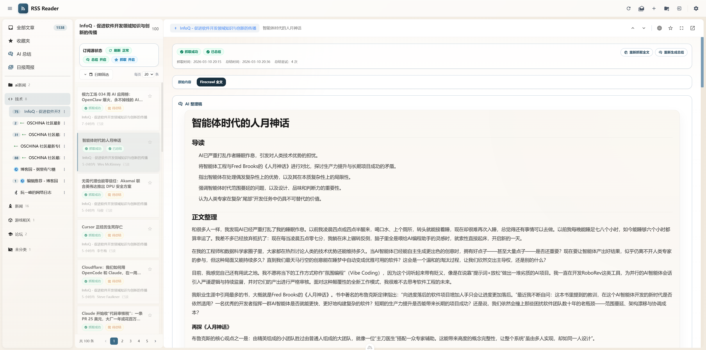
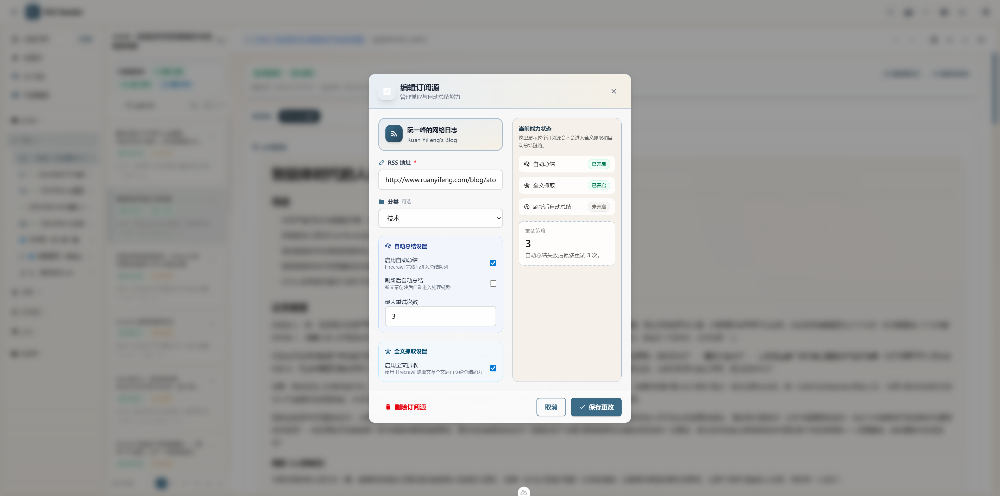
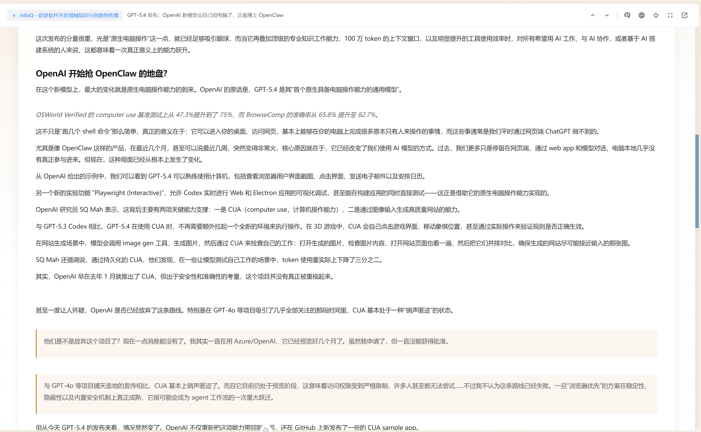
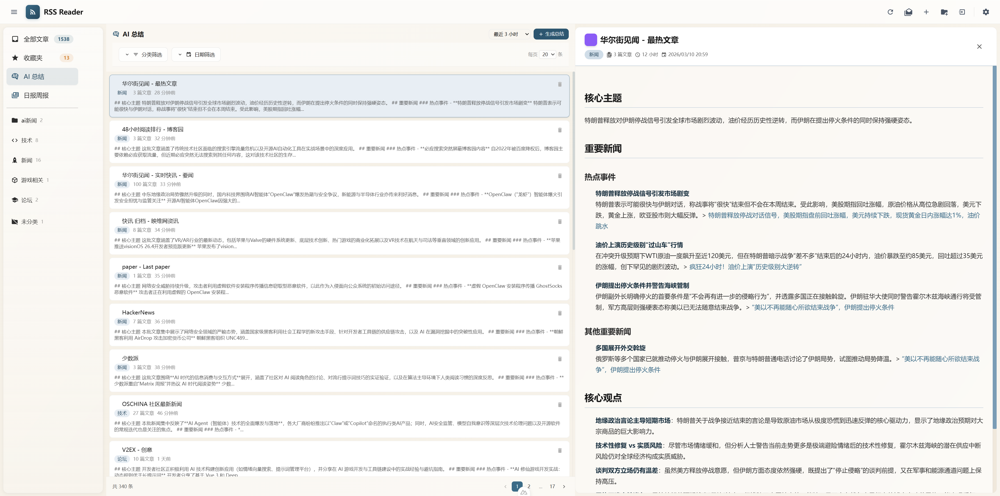
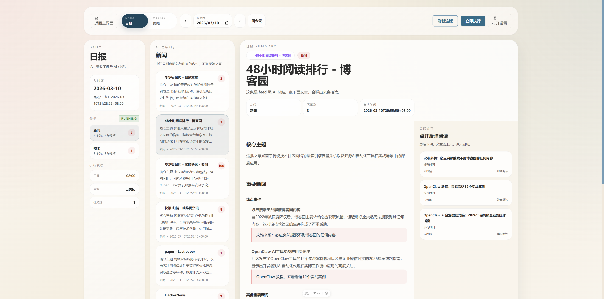

# RSS Reader

基于 Go + Nuxt 4 的 RSS 阅读器，三栏阅读界面，支持 AI 智能增强与内容汇总。



## ✨ 核心功能

### 📰 订阅管理

- Feed 管理：添加、编辑、删除、手动刷新、全量刷新
- 分类管理：自定义名称、图标、颜色
- OPML 导入导出
- 可配置自动刷新间隔



### 📖 文章阅读

- FeedBro 风格三栏布局
- 收藏、已读标记、全屏阅读
- 预览模式与 iframe 模式切换
- 上一篇/下一篇快速导航



### 🤖 智能增强

- Firecrawl 全文抓取，补全 RSS 摘要内容
- AI 内容整理，生成结构化正文
- 内容源切换：原始内容 / Firecrawl 全文 / AI 整理稿


### 🧠 AI 总结

- 批量生成分类/Feed 级 AI 总结
- 按分类、订阅源、日期过滤
- WebSocket 实时显示生成进度



### 📊 阅读偏好

- 自动追踪阅读行为（打开、关闭、滚动、收藏）
- 偏好分数计算，优化排序
- 阅读统计展示

### 📰 Digest 汇总

- 日报/周报自动生成
- 飞书机器人推送
- Obsidian 笔记导出
- 可配置定时任务



## 🛠 技术栈

| 层级 | 技术 |
|------|------|
| 前端 | Nuxt 4 + Vue 3 + TypeScript + Pinia + Tailwind CSS v4 |
| 后端 | Go + Gin + GORM + SQLite |
| AI | OpenAI 兼容 API |

## 🚀 快速开始

### 前端

```bash
cd front
pnpm install
pnpm dev
```

### 后端

```bash
cd backend-go
go mod tidy
go run cmd/server/main.go
```

### 访问地址

- 前端：http://localhost:3001
- 后端：http://localhost:5000

## 📂 项目结构

```
my-robot/
├── front/        # Nuxt 4 前端
├── backend-go/   # Go + Gin 后端
├── docs/         # 项目文档
└── tests/        # 测试材料
```

## 📚 文档

- 项目总览：docs/architecture/overview.md
- 前端架构：docs/architecture/frontend.md
- 后端架构：docs/architecture/backend-go.md
- 功能说明：docs/guides/frontend-features.md
- 开发指南：docs/operations/development.md