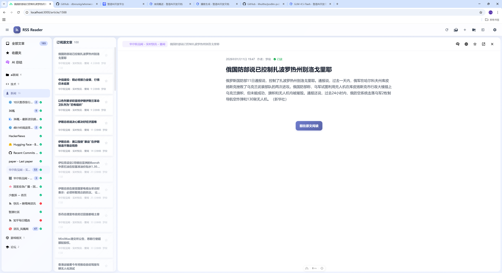
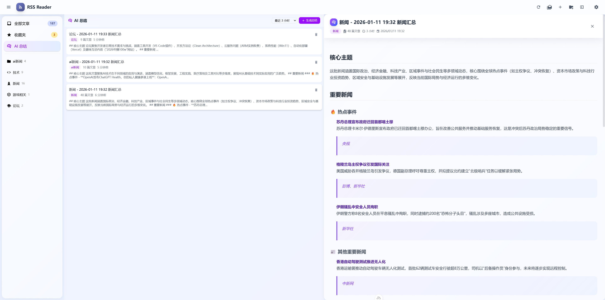
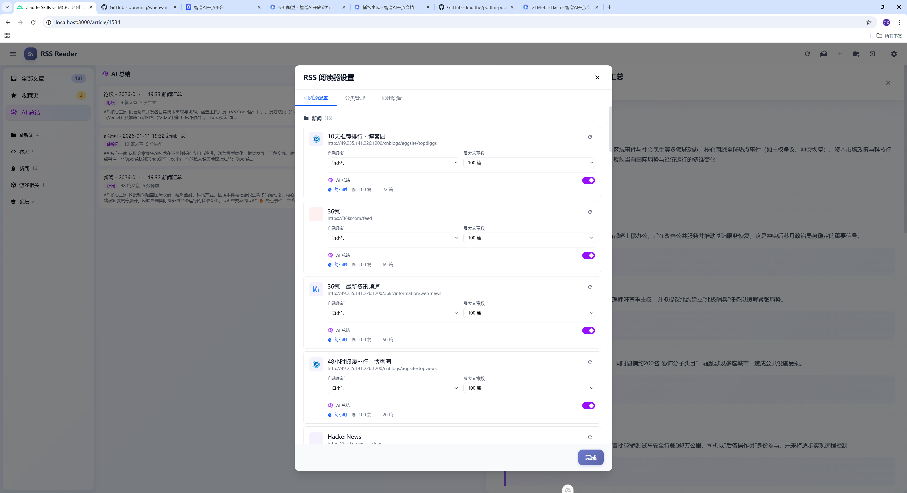

# RSS 订阅管理系统

一个功能强大的 RSS 订阅管理系统，支持 AI 智能分析、分类管理、自动刷新和文章阅读。

## 界面预览

### 📰 文章阅读界面
清爽的三栏布局设计，左侧分类导航，中间文章列表，右侧文章内容阅读区。



### 🤖 AI 智能摘要
AI 自动分析文章内容，提取核心观点、关键要点并生成标签。



### ⚙️ 全局设置
支持 AI 服务配置、定时任务管理、OPML 导入导出等功能。



## 项目架构

### 技术栈

**后端 (Go)**:
- **框架**: Gin v1.10.0 (高性能 HTTP Web 框架)
- **ORM**: GORM v1.25.12
- **数据库**: SQLite (轻量级，零配置)
- **RSS 解析**: gofeed v1.3.0
- **定时任务**: cron v3
- **配置管理**: Viper v1.19.0

**前端 (Nuxt 4)**:
- **框架**: Nuxt 4.2.2 + Vue 3.5.26
- **样式**: Tailwind CSS v4
- **状态管理**: Pinia v3.0.4
- **TypeScript**: 类型安全
- **工具库**: VueUse, Day.js, Iconify, Marked, motion-v

### 项目结构

```
my-robot/
├── backend-go/              # Go 后端 (Gin + GORM)
│   ├── cmd/                 # 入口命令
│   │   ├── migrate/         # 数据库迁移工具
│   │   └── server/          # HTTP 服务主入口
│   ├── internal/            # 内部包
│   │   ├── config/          # 配置管理
│   │   ├── handlers/        # HTTP 处理器 (API 路由)
│   │   │   ├── ai.go        # AI 相关接口
│   │   │   ├── article.go   # 文章接口
│   │   │   ├── category.go  # 分类接口
│   │   │   ├── feed.go      # 订阅接口
│   │   │   ├── opml.go      # OPML 导入导出
│   │   │   ├── scheduler.go # 调度器管理
│   │   │   └── summary.go   # AI 摘要接口
│   │   ├── middleware/      # 中间件 (CORS)
│   │   ├── models/          # 数据模型 (GORM)
│   │   │   ├── ai_models.go
│   │   │   ├── article.go
│   │   │   ├── category.go
│   │   │   └── feed.go
│   │   ├── schedulers/      # 定时任务
│   │   │   ├── auto_refresh.go
│   │   │   └── auto_summary.go
│   │   └── services/        # 业务逻辑
│   │       ├── ai_service.go
│   │       ├── feed_service.go
│   │       └── rss_parser.go
│   ├── pkg/                 # 公共包
│   │   └── database/        # 数据库连接
│   ├── configs/             # 配置文件
│   ├── go.mod               # Go 模块定义
│   └── rss_reader.db        # SQLite 数据库
│
└── front/                   # Nuxt 4 前端
    ├── app/
    │   ├── app.vue          # 根组件
    │   ├── components/      # Vue 组件
    │   │   ├── layout/      # 布局组件
    │   │   │   ├── AppHeader.vue
    │   │   │   ├── AppSidebar.vue
    │   │   │   └── ArticleListPanel.vue
    │   │   ├── article/     # 文章组件
    │   │   │   ├── ArticleCard.vue
    │   │   │   └── ArticleContent.vue
    │   │   ├── category/    # 分类组件
    │   │   ├── feed/        # 订阅组件
    │   │   ├── ai/          # AI 摘要组件
    │   │   └── dialog/      # 对话框组件
    │   ├── composables/     # 组合式函数
    │   │   └── api/         # API 层
    │   │       ├── client.ts
    │   │       ├── categories.ts
    │   │       ├── feeds.ts
    │   │       ├── articles.ts
    │   │       ├── summaries.ts
    │   │       └── opml.ts
    │   ├── stores/          # Pinia 状态管理
    │   │   ├── api.ts       # API Store
    │   │   ├── feeds.ts     # 订阅源 Store
    │   │   └── articles.ts  # 文章 Store
    │   ├── types/           # TypeScript 类型
    │   ├── utils/           # 工具函数
    │   └── plugins/         # Nuxt 插件
    ├── nuxt.config.ts       # Nuxt 配置
    └── package.json         # 依赖管理
```

## 后端架构 (Go)

### 核心特性
- **高性能**: Go 并发处理，性能优于 Python 实现
- **API 兼容**: 100% 兼容原 Python 后端 API
- **类型安全**: 编译时类型检查，减少运行时错误
- **单二进制部署**: 编译后无需运行时环境
- **优雅关机**: 支持 SIGTERM 信号处理

### 数据库模型

**关系图**:
```
Category (1) ←── (N) Feed (1) ←── (N) Article
     ↑
     └──────────────────────────────────── AISummary
```

**级联删除**:
- 删除分类 → 删除其所有订阅源
- 删除订阅源 → 删除其所有文章

### API 路由

| 分类 | 端点 | 方法 | 功能 |
|------|------|------|------|
| **分类** | `/api/categories` | GET/POST/PUT/DELETE | 分类 CRUD |
| **订阅** | `/api/feeds` | GET/POST/PUT/DELETE | 订阅 CRUD |
| | `/api/feeds/:id/refresh` | POST | 刷新单个订阅 |
| | `/api/feeds/fetch` | POST | 预览订阅 |
| | `/api/feeds/refresh-all` | POST | 刷新所有订阅 |
| **文章** | `/api/articles` | GET | 获取文章列表 |
| | `/api/articles/stats` | GET | 统计信息 |
| | `/api/articles/:id` | GET | 单篇文章 |
| | `/api/articles/:id` | PUT | 更新状态 |
| | `/api/articles/bulk-update` | PUT | 批量更新 |
| **AI** | `/api/ai/summarize` | POST | 生成摘要 |
| | `/api/ai/test` | POST | 测试连接 |
| | `/api/ai/settings` | GET/POST | AI 配置 |
| **摘要** | `/api/summaries` | GET | 摘要列表 |
| | `/api/summaries/generate` | POST | 生成摘要 |
| | `/api/summaries/:id` | GET/DELETE | 摘要详情 |
| **OPML** | `/api/import-opml` | POST | 导入 OPML |
| | `/api/export-opml` | GET | 导出 OPML |
| **调度器** | `/api/schedulers/status` | GET | 调度器状态 |
| | `/api/schedulers/:name/trigger` | POST | 手动触发 |

### 定时调度器

**自动刷新**:
- 每 60 秒检查一次
- 根据订阅的 `refresh_interval` 自动刷新
- 状态追踪和错误日志

**自动摘要**:
- 每 3600 秒 (1小时) 运行一次
- 为所有分类生成 AI 摘要
- 支持 OpenAI 兼容 API

## 前端架构 (Nuxt 4)

### 核心特性
- **Composition API**: 使用 `<script setup>` 语法
- **TypeScript**: 完整类型定义
- **Pinia 状态管理**: 双 Store 模式
- **响应式布局**: FeedBro 风格三栏布局
- **组件化**: 高度模块化设计

### 三栏布局

```
┌─────────────────────────────────────────────────────────────┐
│  AppHeader (顶部工具栏: 刷新 / 添加订阅 / 导入 / 设置)       │
├────────────────┬──────────────────┬─────────────────────────┤
│  AppSidebar    │ ArticleListPanel │    ArticleContent     │
│  (左侧边栏)    │   (中间文章列表)  │    (右侧阅读区)        │
│                │                  │                         │
│  • 分类树      │  • 搜索栏        │    • 文章标题          │
│  • 订阅列表    │  • 筛选排序      │    • 元信息            │
│  • 操作菜单    │  • 文章卡片列表  │    • 正文内容          │
│                │                  │    • AI 摘要           │
└────────────────┴──────────────────┴─────────────────────────┘
```

### 状态管理

**双 Store 模式**:
```
后端 API
    ↓ (fetch)
useApiStore (数据源)
    ↓ (syncToLocalStores)
useFeedsStore / useArticlesStore (本地状态)
    ↓ (reactive)
UI 组件
```

**API Store** (`stores/api.ts`):
- 与后端通信
- 数据源管理
- 提供 CRUD 方法

**Local Stores** (`stores/feeds.ts`, `stores/articles.ts`):
- 本地状态缓存
- 计算属性 (未读数、统计等)
- UI 响应式数据

### API 层

**目录结构**:
```
composables/api/
├── client.ts       # 基础 HTTP 客户端
├── categories.ts   # 分类 API
├── feeds.ts        # 订阅 API
├── articles.ts     # 文章 API
├── summaries.ts    # AI 摘要 API
└── opml.ts         # OPML API
```

**使用模式**:
```typescript
const { getFeeds, createFeed } = useFeedsApi()
const response = await getFeeds()
if (response.success) {
  // 处理 response.data
}
```

## 功能特性

### AI 智能分析
- **文章智能总结**: 使用 AI 对单篇文章进行智能摘要
  - 一句话总结
  - 核心观点提取
  - 关键要点归纳
  - 自动标签生成
- **分类聚合摘要**: 按分类对多篇文章进行聚合分析
  - 支持自定义时间范围
  - 自动提取核心趋势
  - 跨文章主题关联
- **兼容多种 AI 服务**: 支持 OpenAI 及兼容 API
- **定时自动摘要**: 自动为新增文章生成 AI 摘要
- **AI 配置管理**: 灵活配置 AI 服务参数

### RSS 订阅管理
- 添加/删除 RSS 订阅源
- 订阅源预览功能
- 自动获取 RSS 文章
- 订阅源分类管理
- **自动刷新**: 支持定时自动刷新订阅源
  - 自定义刷新间隔
  - 刷新状态监控
  - 错误日志记录
- **文章数量控制**: 每个订阅源可设置最大文章保留数量

### 文章阅读
- 文章列表展示
- 已读/未读标记
- 收藏文章功能
- 文章内容阅读
- 在原网站查看

### 分类功能
- 创建/编辑/删除分类
- 按分类查看订阅
- 分类统计信息

### 数据导入导出
- OPML 格式导入
- OPML 格式导出
- 批量管理订阅源

### 定时任务
- 自动刷新调度器
- AI 摘要生成调度器
- 任务执行状态监控
- 执行历史和错误日志

## 安装和运行

### 前置要求

- **Go**: 1.23+ (后端)
- **Node.js**: 18.x+ (前端)
- **pnpm**: 10.15.0+ (前端包管理器)
- **SQLite3**: 数据库 (Go 自动管理)

### 后端启动 (Go)

```bash
cd backend-go

# 下载依赖
go mod tidy

# 运行服务 (默认端口 5000)
go run cmd/server/main.go

# 或使用 air 热重载 (需安装 air)
air
```

**数据库迁移** (可选):
```bash
# 检查数据库连接
go run cmd/migrate/main.go check

# 执行迁移
go run cmd/migrate/main.go migrate

# 重建数据库 (危险操作)
go run cmd/migrate/main.go fresh
```

### 前端启动 (Nuxt 4)

```bash
cd front

# 安装依赖
pnpm install

# 启动开发服务器 (端口 3001)
pnpm dev

# 生产构建
pnpm build

# 预览生产构建
pnpm preview
```

### 同时启动 (Windows)

```bash
# 使用批处理脚本
start-all.bat
```

### 访问地址

- **前端**: http://localhost:3001
- **后端 API**: http://localhost:5000/api
- **健康检查**: http://localhost:5000/health

## 使用说明

### 基本使用

1. 启动后端和前端服务
2. 访问 `http://localhost:3001`
3. 创建分类并添加 RSS 订阅源
4. 系统将自动抓取文章

### AI 功能配置

1. 点击设置中的 "AI 配置"
2. 填写 AI 服务信息：
   - **API 地址**: 如 `https://api.openai.com/v1`
   - **API Key**: 您的 API 密钥
   - **模型**: 如 `gpt-4o-mini`
3. 测试连接并保存
4. 启用定时任务自动生成摘要

### 推荐的 AI 服务

- **OpenAI**: [https://openai.com](https://openai.com)
- **DeepSeek**: [https://deepseek.com](https://deepseek.com)
- **其他兼容 OpenAI API 的服务**

## 配置文件

### 后端配置 (`backend-go/configs/config.yaml`)

```yaml
server:
  port: "5000"        # HTTP 端口
  mode: "debug"       # debug / release / test

database:
  driver: "sqlite"
  dsn: "rss_reader.db"  # 数据库文件

cors:
  origins:
    - "http://localhost:3001"
    - "http://localhost:3000"
  methods: ["GET", "POST", "PUT", "DELETE", "OPTIONS"]
  allow_headers: ["Content-Type", "Authorization"]
```

**环境变量覆盖**:
```bash
# 服务器端口
export SERVER_PORT=5000

# 运行模式
export SERVER_MODE=release

# 数据库
export DATABASE_DSN=rss_reader.db
```

### 前端配置 (`front/app/utils/constants.ts`)

```typescript
export const API_BASE_URL = 'http://localhost:5000/api'
```

## 项目特色

- **无用户认证**: 简化部署，专注个人使用
- **AI 深度集成**: 智能总结、聚合分析、自动摘要
- **自动化**: 定时刷新、自动摘要、智能推荐
- **轻量级**: SQLite 数据库，零配置启动
- **高性能**: Go 并发后端，快速响应
- **现代化**: Nuxt 4 + Go 1.23，最新技术栈
- **类型安全**: 全栈 TypeScript + Go 强类型
- **单二进制部署**: 后端编译后无需依赖

## 后端对比：Python vs Go

| 特性 | Python (Flask) | Go (Gin) |
|------|----------------|----------|
| **性能** | 中等 | 高 (并发处理) |
| **启动时间** | 较慢 (~2-3秒) | 快 (<1秒) |
| **内存占用** | 较高 (~100MB) | 低 (~10-20MB) |
| **开发效率** | 高 | 中等 |
| **类型安全** | 运行时 | 编译时 |
| **部署** | 需要解释器 + 依赖 | 单二进制文件 |
| **API 兼容** | 基准实现 | 100% 兼容 |
| **并发处理** | GIL 限制 | 原生 goroutine |

### 为什么选择 Go 后端？

1. **性能提升**: 并发处理订阅刷新，速度提升 5-10 倍
2. **资源效率**: 内存占用降低 80%，适合低配置服务器
3. **部署简单**: 单个可执行文件，无需管理 Python 环境
4. **类型安全**: 编译时错误检查，减少运行时问题
5. **API 兼容**: 前端无需任何修改即可切换

**注意**: Python 后端已删除，完全迁移至 Go 后端。

---


## 📋 未来规划 (TODO)[]

### 🎙️ AI 播客功能 (优先级：高)[]

#### 阶段一：本地 TTS 集成[]

#### 阶段二：调侃式播客集成[]

#### 阶段三：小米小爱音箱对接[]

#### 阶段四：高级功能[]
---

## 许可证

GPLv3

本项目采用 GNU General Public License v3.0 开源许可证。详见 [LICENSE](LICENSE) 文件。

### 使用许可

- ✅ 商业使用
- ✅ 修改
- ✅ 分发
- ✅ 私人使用

### 条件和限制

- ⚠️ 必须包含原始许可证和版权声明
- ⚠️ 必须说明对文件的修改
- ⚠️ 必须以相同的许可证发布衍生作品
- ⚠️ 必须提供源代码
- ❌ 不得提供责任担保
- ❌ 不得使用作者名义进行宣传
