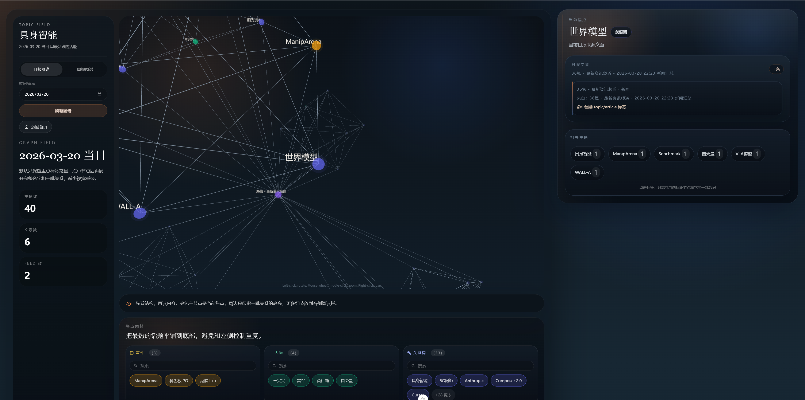
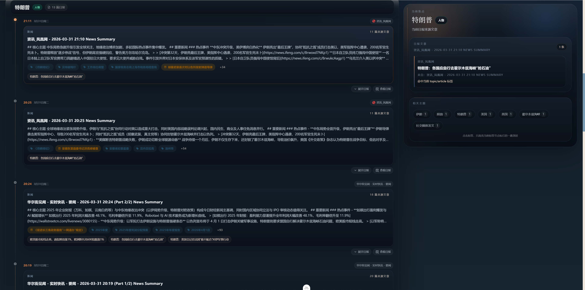

<!-- generated-by: gsd-doc-writer -->

# RSS Reader

基于 Go + Nuxt 4 的个人 RSS 阅读器，三栏阅读界面，支持 AI 智能增强、主题图谱与内容汇总。


## ✨ 核心功能

### 主题图谱
- 追踪事件之间的关联与时间线演变
- AI 去重、打标签、梳理事件链路
- 跨时间段分析、单事件演变、事件聚合





### 📰 订阅管理
- Feed 管理：添加、编辑、删除、手动刷新、全量刷新
- 分类管理：自定义名称、图标、颜色
- OPML 导入导出
- 可配置自动刷新间隔


### 📖 文章阅读
- FeedBro 风格三栏布局
- 收藏、已读标记、全屏阅读
- 预览模式与 iframe 模式切换
- 上一篇/下一篇快速导航


### 🤖 智能增强
- Firecrawl 全文抓取，补全 RSS 摘要内容
- AI 内容整理，生成结构化正文
- 内容源切换：原始内容 / Firecrawl 全文 / AI 整理稿


### 🧠 AI 总结
- 批量生成分类/Feed 级 AI 总结
- 按分类、订阅源、日期过滤
- WebSocket 实时显示生成进度


### 📊 阅读偏好
- 自动追踪阅读行为（打开、关闭、滚动、收藏）
- 偏好分数计算，优化排序
- 阅读统计展示

### 📰 Digest 汇总
- 日报/周报自动生成
- 飞书机器人推送
- Obsidian 笔记导出
- 可配置定时任务


## 🛠 技术栈

| 层级 | 技术 |
|------|------|
| 前端 | Nuxt 4 + Vue 3 + TypeScript + Pinia + Tailwind CSS v4 |
| 后端 | Go + Gin + GORM + SQLite |
| AI | OpenAI 兼容 API |

## 🚀 快速开始

### 前置条件

- [Node.js](https://nodejs.org/) >= 18
- [pnpm](https://pnpm.io/) >= 10
- [Go](https://go.dev/) >= 1.25
- [Docker](https://www.docker.com/)（可选，用于容器化部署）

### Docker Compose（推荐）

```bash
cp .env.example .env
docker compose -f docker-compose.sqlite.yml up --build
```

- 前端默认地址：`http://localhost:3001`
- 后端默认地址：`http://localhost:5000`
- SQLite 文件默认落在仓库根目录 `data/rss_reader.db`
- 如需自定义端口或代理，在 `.env` 中配置 `FRONT_PORT`、`BACKEND_PORT`、`GOPROXY`、`NPM_CONFIG_REGISTRY` 等

如需 PostgreSQL（支持 pgvector 向量搜索），先启动数据库：

```bash
docker compose up -d
```

### 前端

```bash
cd front
pnpm install
pnpm dev
```

前端开发服务器默认运行在 `http://localhost:3001`。

### 后端

```bash
cd backend-go
go mod tidy
go run cmd/server/main.go
```

后端默认运行在 `http://localhost:5000`。

## 📂 项目结构

```
my-robot/
├── front/                    # Nuxt 4 前端（Vue 3 + TypeScript + Pinia）
├── backend-go/               # Go + Gin 后端（GORM + SQLite）
├── docs/                     # 项目文档
├── tests/                    # Python 集成测试
├── docker/                   # Docker 构建配置
├── img/                      # 截图和图片资源
├── data/                     # SQLite 数据库文件（运行时生成）
├── docker-compose.sqlite.yml # Docker Compose（SQLite 模式）
└── docker-compose.yml        # Docker Compose（PostgreSQL + pgvector）
```

## 📚 文档

### 架构
- [项目总览](docs/architecture/overview.md) — 架构与运行关系
- [前端架构](docs/architecture/frontend.md) — Nuxt 4 前端结构
- [后端架构](docs/architecture/backend-go.md) — Go 后端结构
- [数据流](docs/architecture/data-flow.md) — 数据流转与处理流程

### 操作指南
- [快速上手](docs/guides/getting-started.md) — 环境搭建与首次运行
- [配置说明](docs/guides/configuration.md) — 环境变量与配置项
- [开发指南](docs/operations/development.md) — 本地开发、构建、测试
- [测试指南](docs/guides/testing.md) — 测试框架与运行方式
- [部署指南](docs/guides/deployment.md) — 容器化部署与生产配置

### 功能说明
- [内容处理](docs/guides/content-processing.md) — Firecrawl 与 AI 增强流程
- [Digest 汇总](docs/guides/digest.md) — 日报/周报生成与推送
- [主题图谱](docs/guides/topic-graph.md) — 主题图谱功能说明
- [阅读偏好](docs/guides/reading-preferences.md) — 偏好追踪与排序

### API
- [API 参考](docs/api/reference.md) — 后端 API 接口文档
- [主题图谱 API](docs/api/topic-graph.md) — 主题图谱接口说明

## 🤝 贡献

参见 [CONTRIBUTING.md](CONTRIBUTING.md) 了解贡献指南。

## License

[GNU General Public License v3.0](LICENSE)
