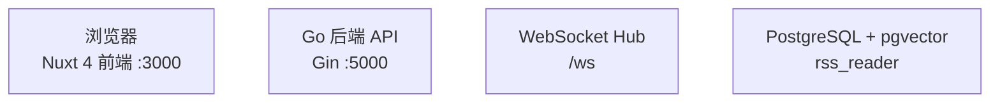

<!-- generated-by: gsd-doc-writer -->
# 项目架构总览

## 系统概述

RSS Reader 是一个个人部署的 RSS 阅读器，采用前后端分离的单体架构。Go 后端（Gin + GORM + PostgreSQL + pgvector）负责 RSS 订阅拉取、文章持久化、AI 内容增强（Firecrawl 全文抓取、AI 整理稿生成）、AI 摘要聚合、主题图谱分析、Digest 日报/周报输出和阅读偏好追踪。Nuxt 4 前端（Vue 3 + Pinia + Tailwind CSS v4）以 FeedBro 风格三栏布局呈现订阅、文章和正文，同时提供 Digest 视图和主题图谱页面。前后端通过 REST API 和 WebSocket 通信，系统面向单用户部署，不含认证体系。

> **注意：SQLite 版本已归档到 `sqlite` 独立分支，主分支不再维护 SQLite 支持。如需使用 SQLite 版本请切换到 `sqlite` 分支。**

## 技术栈

| 层级 | 技术 | 说明 |
|------|------|------|
| 前端 | Nuxt 4 + Vue 3 + TypeScript + Pinia + Tailwind CSS v4 | SSR/SPA 混合，Composition API |
| 后端 | Go + Gin + GORM + PostgreSQL + pgvector | 单二进制 HTTP 服务 |
| AI | OpenAI 兼容 API（通过 airouter 多 provider 路由） | 摘要、内容补全、主题分析 |
| 全文抓取 | Firecrawl | RSS 摘要补全为完整正文 |
| 实时通信 | Gorilla WebSocket | AI 摘要队列进度推送 |
| 定时任务 | robfig/cron | feed 刷新、摘要生成、偏好更新、digest 输出 |
| 可观测性 | OpenTelemetry + GORM Span Exporter（存入 PostgreSQL） | 链路追踪落库 + 查询 API |
| 配置 | Viper + `configs/config.yaml` | 运行时配置加载 |
| 部署 | Docker Compose | 前后端 + PostgreSQL 三容器，pgdata 持久化卷 |
| 许可证 | GNU General Public License v3 | 见 [LICENSE](../../LICENSE) |

## 组件关系图



### Mermaid 图例 / 读图说明

- 节点框：表示一个组件、服务或状态节点；框内通常是名称 + 补充信息。
- 箭头：表示方向性关系。组件图里通常表示调用、依赖或数据流；状态图里表示状态迁移。
- 起点 / 终态：在 `stateDiagram-v2` 中，`[*] --> 状态A` 表示入口，`状态B --> [*]` 表示终态或流程结束。
- 标签：箭头旁的文字一般表示触发条件、动作或迁移原因；如果没有标签，默认按箭头方向阅读即可。

当前文档里的 Mermaid 主要是组件关系图；如果后续文档出现状态图，建议按“起点 -> 中间状态 -> 终态”的顺序阅读，再看每条箭头上的条件说明。

## 核心子系统

### 1. 订阅与文章（基础数据面）

Feed 管理（`backend-go/internal/domain/feeds/`）和文章管理（`backend-go/internal/domain/articles/`）构成系统的基础数据层。Feed 刷新拉取 RSS 源、去重入库文章，后续所有增强能力（Firecrawl、内容补全、摘要、主题分析）都建立在文章记录之上。Feed 配置项（`firecrawl_enabled`、`article_summary_enabled`、`refresh_interval`）决定文章入库后的初始状态流转。

### 2. AI 与内容增强

三层叠加架构：

- **AI Router**（`backend-go/internal/platform/airouter/`）：管理多 AI provider 和 capability route，支持 failover
- **内容处理**（`backend-go/internal/domain/contentprocessing/`）：Firecrawl 全文抓取、AI 内容补全生成整理稿
- **摘要系统**（`backend-go/internal/domain/summaries/`）：按 feed/分类聚合批量生成 AI 摘要

### 3. 主题图谱

拆分为四个包，形成从标签提取到图谱展示的完整链路：

- `topictypes`：共享类型和窗口工具
- `topicextraction`：从摘要/文章提取 topic tag
- `topicanalysis`：主题分析任务与结果、embedding 向量化、标签合并、关注标签、抽象标签管理
- `topicgraph`：图谱节点边、详情、相关文章查询

此外，`topicanalysis` 还承担了以下高级能力：
- 标签 embedding 向量化与自动合并（基于 pgvector 余弦相似度）
- 关注标签（watched tags）管理
- 抽象标签（abstract tags）层级体系
- 合并后 re-embedding 队列

### 4. Digest 输出

完整子系统（`backend-go/internal/domain/digest/`），支持 daily/weekly 时间窗，具备配置管理、预览、手动执行、定时调度、多出口分发（飞书、Obsidian、Open Notebook）。

### 5. 阅读偏好

行为追踪与偏好分析（`backend-go/internal/domain/preferences/`），前端批量上报阅读事件，后端计算偏好分数并更新排序权重。

### 6. 叙事摘要

叙事摘要子系统（`backend-go/internal/domain/narrative/`），基于活跃主题标签生成每日叙事摘要。由 `NarrativeSummaryScheduler` 定时触发，支持按日期查询、历史版本回溯。前端通过 `/api/narratives` 接口读取。

### 7. 链路追踪

OpenTelemetry 集成（`backend-go/internal/platform/tracing/`），HTTP 请求和调度器入口自动创建 span，自定义 GORM Span Exporter 落库到 PostgreSQL 的 `otel_spans` 表，提供 trace 查询和统计 API。

## 数据流

系统主数据流按以下路径运行：

```text
RSS 源
  → 后端定时/手动拉取解析
  → PostgreSQL 持久化（feeds + articles）
  → [可选] Firecrawl 全文抓取 → 内容补全生成 AI 整理稿
  → [可选] AI 按订阅/分类聚合摘要
  → [可选] 主题标签提取 → 主题分析 → 图谱构建
  → [可选] 主题标签 embedding 向量化 → 自动合并相似标签 → 叙事摘要生成
  → [可选] Digest 日报/周报聚合 → 多出口分发
  → 前端 REST API 拉取 / WebSocket 推送
  → Pinia store 映射为 camelCase 前端模型
  → feature 组件消费渲染
```

前端内部数据流：

```text
pages（路由入口）
  → features/*/components（业务壳）
  → app/api/*（唯一 HTTP 边界）
  → stores/api.ts（主数据源 useApiStore）
  → stores/feeds.ts + stores/articles.ts（派生视图）
  → 组件渲染
```

## 目录结构

```text
my-robot/
├── front/                    # Nuxt 4 前端
│   ├── app/
│   │   ├── api/              # 唯一 HTTP 边界，领域 API 模块
│   │   ├── assets/css/       # 全局主题与样式
│   │   ├── components/       # 通用可复用组件（ai, article, category, common, dialog, feed, layout）
│   │   ├── composables/      # 跨 feature 通用能力（useAI, useRssParser）
│   │   ├── features/         # 业务实现主体（shell, articles, summaries, digest, feeds, preferences, topic-graph, ai）
│   │   ├── pages/            # Nuxt 路由入口（index, digest/, topics）
│   │   ├── plugins/          # Nuxt 插件（dayjs）
│   │   ├── stores/           # Pinia store（api, feeds, articles, preferences, aiAnalysis）
│   │   ├── types/            # 领域类型定义（api, article, category, feed, ai, common, reading_behavior, scheduler, timeline）
│   │   └── utils/            # 常量和纯工具函数（api, date, text, storage, constants 等）
│   ├── server/               # Nuxt 服务端工具
│   ├── public/               # 静态资源
│   ├── tests/                # 前端单元测试
│   ├── nuxt.config.ts        # Nuxt 配置
│   └── package.json
├── backend-go/               # Go + Gin 后端
│   ├── cmd/                  # 启动入口（server, migrate-digest, migrate-tags, test-digest, migrate-db, migrate-embedding-queue, test-embedding）
│   ├── configs/              # 配置文件（config.yaml）
│   └── internal/
│       ├── app/              # 应用装配（router.go, runtime.go, runtimeinfo/）
│       ├── domain/           # 业务域（14 个子包：feeds, articles, categories, summaries, contentprocessing, digest, preferences, aiadmin, models, topictypes, topicextraction, topicanalysis, topicgraph, narrative）
│       ├── jobs/             # 调度外壳（10 类定时任务 + handler）
│       └── platform/         # 共享基础设施（config, database, logging, middleware, ws, ai, airouter, aisettings, opennotebook, tracing）
├── docs/                     # 项目文档
│   ├── architecture/         # 架构文档（本文档及子模块架构）
│   ├── api/                  # API 文档（按领域拆分，见 api/_index.md）
│   ├── guides/               # 功能指南（content-processing, digest, topic-graph 等）
│   ├── operations/           # 运维文档（development, database, troubleshooting 等）
│   ├── database/             # 数据库字段说明
│   ├── experience/           # 经验沉淀（踩坑记录、编码安全）
│   └── plans/                # 历史设计/实施计划
├── tests/                    # 独立测试
│   ├── workflow/             # Python 集成测试（scheduler、workflow）
│   └── firecrawl/            # Firecrawl 集成检查
├── docker/                   # Docker 相关配置
│   └── postgres/             # PostgreSQL 迁移支持
├── data/                     # 运行时数据（PostgreSQL 数据持久化，旧 SQLite 文件残留）
├── docker-compose.sqlite.yml # Docker Compose 主配置（SQLite 模式，前后端双容器）
├── docker-compose.yml        # Docker Compose PostgreSQL 服务（pgvector 扩展）
├── .env.example              # 环境变量模板
├── AGENTS.md                 # 代理协作规则
└── README.md                 # 项目简介与启动指南
```

## 关键设计决策

- **单用户部署**：不含认证体系，前后端直连，适合个人使用场景
- **PostgreSQL + pgvector 持久化**：支持向量检索、关系查询，通过 Docker volume 持久化
- **状态位驱动的内容增强**：文章入库时按 feed 配置设置 `firecrawl_status` 和 `summary_status`，后续调度器按状态位流转处理
- **Feature-based 前端组织**：业务逻辑按 feature 目录组织（`features/*`），不再堆积在通用 `components/` 目录
- **snake_case → camelCase 边界映射**：后端 snake_case 在 API/store 边界统一转 camelCase，组件层不处理字段映射
- **统一调度器管理**：10 类后台任务通过统一 runtime 启动，统一 `/api/schedulers/*` API 查询状态和手动触发
- **多 provider AI 路由**：airouter 管理 provider 和 capability route，支持 failover，而非单 provider 调用

## 后台调度器一览

| 调度器 | 间隔 | 职责 |
|--------|------|------|
| AutoRefresh | 60 秒 | 扫描到点 feed 并触发 RSS 刷新 |
| AutoSummary | 3600 秒 | 按 feed 聚合文章生成 AI 摘要 |
| Firecrawl | 轮询 | 抓取待处理文章完整正文 |
| ContentCompletion | 60 秒 | 基于 Firecrawl 正文生成 AI 整理稿 |
| PreferenceUpdate | 1800 秒 | 更新阅读偏好分数 |
| Digest | Cron | 按 daily/weekly 配置生成并分发 Digest |
| BlockedArticleRecovery | 3600 秒 | 恢复因 Firecrawl 配置变更等原因阻塞的文章 |
| AutoTagMerge | 3600 秒 | 基于 embedding 相似度自动合并相似标签 |
| TagQualityScore | 3600 秒 | 重算 topic_tags.quality_score |
| NarrativeSummary | 86400 秒 | 基于活跃主题标签生成每日叙事摘要 |

## API 面概览

后端通过 `backend-go/internal/app/router.go` 注册以下主路由组：

| 路由组 | 职责 |
|--------|------|
| `/api/categories` | 分类 CRUD |
| `/api/feeds` | 订阅 CRUD、刷新、OPML |
| `/api/articles` | 文章列表、详情、状态更新、统计、标签管理 |
| `/api/ai` | AI provider/route 管理、单篇摘要 |
| `/api/summaries` | 摘要列表、队列任务 |
| `/api/content-completion` | 文章级内容补全触发与状态 |
| `/api/firecrawl` | Firecrawl 抓取、配置、状态 |
| `/api/schedulers` | 统一调度器状态查询和手动触发 |
| `/api/reading-behavior` | 阅读行为上报 |
| `/api/user-preferences` | 偏好查询与更新 |
| `/api/topic-graph` | 主题图谱、分析、相关文章 |
| `/api/topic-graph/analysis` | 主题分析、embedding 配置、标签管理 |
| `/api/embedding` | Embedding 配置与队列管理 |
| `/api/topic-tags` | 关注标签、标签合并预览、抽象标签管理 |
| `/api/digest` | Digest 配置、预览、执行、输出 |
| `/api/narratives` | 叙事摘要查询与历史 |
| `/api/traces` | 链路追踪查询与统计 |
| `/ws` | WebSocket 实时推送 |

## 部署方式

系统通过 Docker Compose 部署：

- **PostgreSQL 模式**（`docker-compose.yml`，默认）：前后端 + PostgreSQL + pgvector 三容器，数据库通过 `pgdata` volume 持久化，支持向量检索
- **SQLite 模式**：已归档到 `sqlite` 分支，使用 `docker-compose.sqlite.yml` 部署，主分支不再维护

默认端口：前端 `http://localhost:3000`，后端 `http://localhost:5000`。开发模式下前端默认运行在 `http://localhost:3000`。

## 相关文档

- [后端架构](backend-go.md)：Go 后端分层、目录结构、数据模型、业务链路详解
- [后端运行时](backend-runtime.md)：启动顺序、调度器管理、路由面、优雅退出
- [前端架构](frontend.md)：Nuxt 4 分层、feature 组织、数据映射规则、设计系统
- [前端组件分工](frontend-components.md)：各 feature 组件职责与交互关系
- [数据流](data-flow.md)：主链路、前端状态职责、定时任务链路
- [链路追踪](tracing.md)：OpenTelemetry 集成、埋点分层、查询 API
- [开发指南](../operations/development.md)：构建、测试、验证命令
- [内容增强](../guides/content-processing.md)：Firecrawl + AI 内容补全流程
- [Digest 指南](../guides/digest.md)：日报/周报配置与输出
- [主题图谱](../guides/topic-graph.md)：图谱构建与分析
- [API 文档](../api/_index.md)：按领域拆分的 REST API 参考
