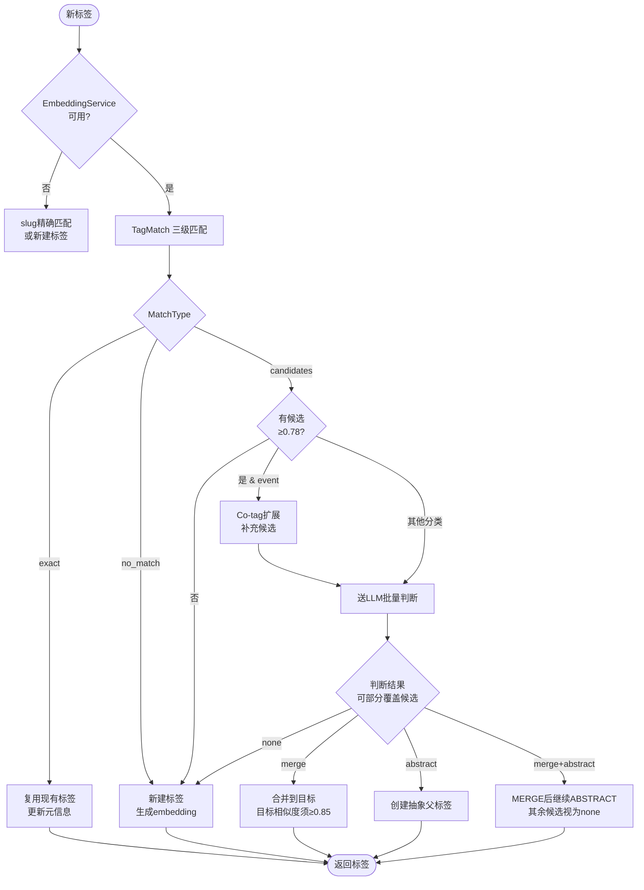
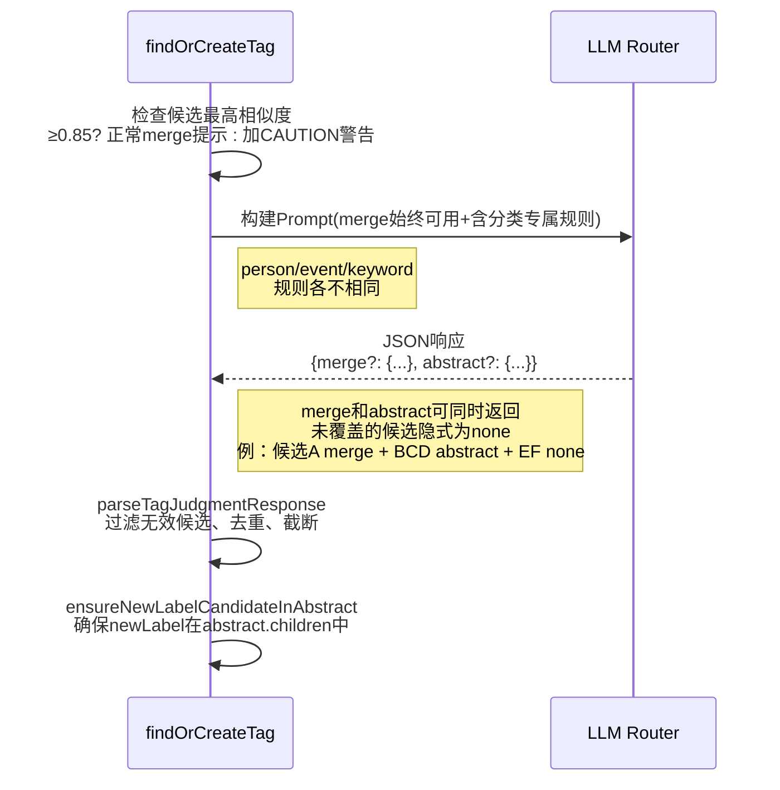
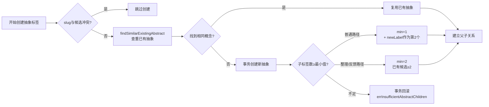
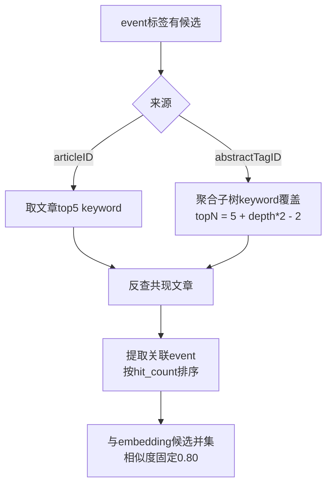
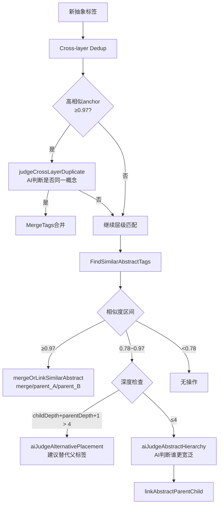
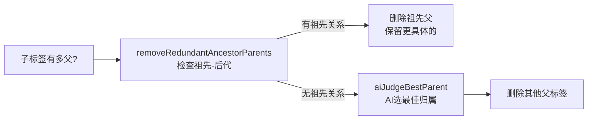
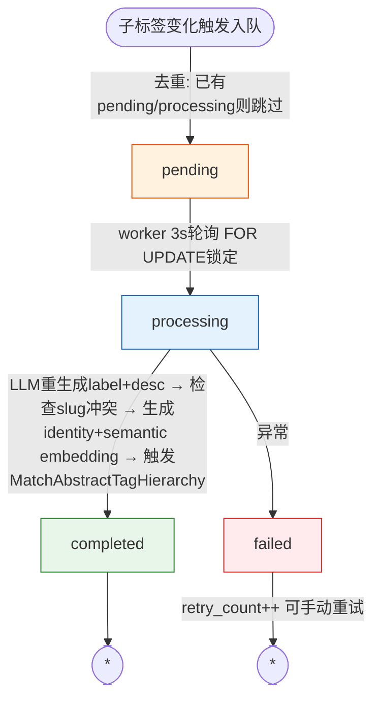
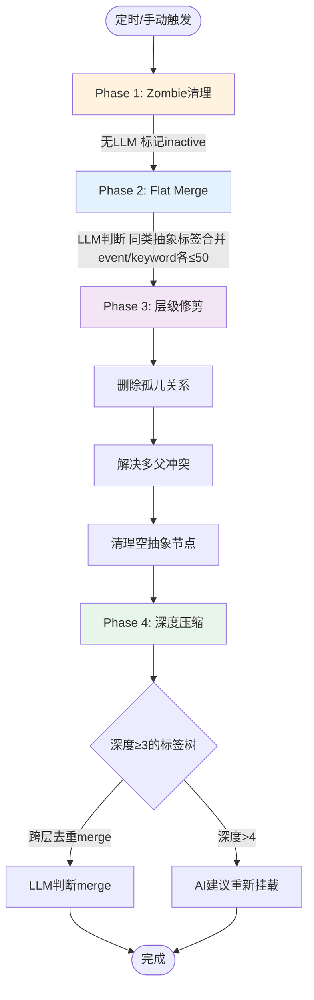

# 打标签流程全景说明

> **版本**：基于 `backend-go/internal/domain/topicanalysis/` 与 `topicextraction/tagger.go` 实际代码整理  
> **阅读建议**：先看主流程图，再按需深入各子章节

---

## 1. 统一入口：`findOrCreateTag`

**触发场景**：文章/摘要生成标签、手动整理、叙事反馈等

```go
输入: tag topictypes.TopicTag, source string, articleContext string, articleID uint
输出: *models.TopicTag  (复用现有 / 新建 / 归入抽象)
```

### 主流程



---

## 2. Embedding 三级匹配：`TagMatch`

| 级别 | 匹配方式 | 阈值 | 行为 |
|------|----------|------|------|
| **L1** | slug 精确匹配 | — | 直接复用 |
| **L1** | 别名(alias)匹配 | — | 直接复用 |
| **L2** | embedding 相似搜索 | ≥0.97 | 自动复用(Exact) |
| **L2** | embedding 相似搜索 | 0.78~0.97 | 送LLM判断(Candidates) |
| **L2** | embedding 相似搜索 | <0.78 | 新建标签(No Match) |

---

## 3. LLM 批量判断：`callLLMForTagJudgment`

**输入**：候选列表(≤8个/批)、新标签名、分类、叙事上下文  
**输出**：`tagJudgment` (merge / abstract / merge+abstract / none)，部分覆盖即可，未覆盖的候选视为独立



### 判断规则速查

| 分类 | Merge条件 | Abstract条件 |
|------|-----------|--------------|
| **person** | 同一人物不同称谓 | 共享身份/机构/领域 |
| **event** | 同一事件不同描述 | 因果关联或同一事件链 |
| **keyword** | 同义词/翻译 | 同一具体领域直接相关 |

---

## 4. 抽象标签创建：`processAbstractJudgment`

**关键保护机制**：



**异步副作用**：
- 生成 `identity` + `semantic` embedding
- 触发 `MatchAbstractTagHierarchy`
- `adoptNarrowerAbstractChildren` 收养更窄的抽象标签
- 入队 `abstract_tag_update_queues`

---

## 5. Event 标签 Co-tag 扩展

**目的**：用文章 keyword 反查共现 event，补充 embedding 召回遗漏



---

## 6. 抽象层级匹配：`MatchAbstractTagHierarchy`

**触发**：新抽象标签创建后、刷新队列完成后



---

## 7. 父子链接与多父冲突

### `linkAbstractParentChild` 保护

| 检查项 | 失败行为 |
|--------|----------|
| 循环检测 | 返回错误 |
| 深度限制(≤4层) | 触发AI建议替代位置 |
| 已存在关系 | 静默跳过 |

### `resolveMultiParentConflict`



---

## 8. Embedding 保留策略


**动态补回**：当普通标签突然获得抽象兄弟时，`enqueueEmbeddingsForNormalChildren` 异步补生成 embedding。

---

## 9. 抽象标签刷新队列

**触发时机**：
- `new_child_added` — `ExtractAbstractTag` 完成
- `hierarchy_linked` — 建立抽象父子关系
- `tag_merged` — 合并到抽象标签
- `adopted_narrower_children` — 收养更窄子标签



> 核心文件: `abstract_tag_update_queue.go`

---

## 10. 核心方法速查

| 方法 | 文件 | 输入 | 输出 | 一句话职责 |
|------|------|------|------|-----------|
| `findOrCreateTag` | `topicextraction/tagger.go` | tag, source, context, articleID | *TopicTag | **统一入口** |
| `TagMatch` | `topicanalysis/embedding.go` | label, category, aliases | TagMatchResult | **三级匹配** |
| `callLLMForTagJudgment` | `topicanalysis/abstract_tag_judgment.go` | candidates, newLabel, category, context | *tagJudgment | **LLM判断** |
| `processJudgment` | `topicanalysis/abstract_tag_service.go` | judgment, candidates, newLabel | TagExtractionResult | **结果处理** |
| `processAbstractJudgment` | `topicanalysis/abstract_tag_service.go` | candidates, judgment, newLabel, category | AbstractResult | **创建抽象标签** |
| `MatchAbstractTagHierarchy` | `topicanalysis/abstract_tag_hierarchy.go` | abstractTagID | - | **层级匹配** |
| `linkAbstractParentChild` | `topicanalysis/abstract_tag_hierarchy.go` | childID, parentID | error | **建立父子关系** |
| `resolveMultiParentConflict` | `topicanalysis/abstract_tag_hierarchy.go` | childID | bool | **解决多父冲突** |
| `ExpandEventCandidatesByArticleCoTags` | `topicanalysis/cotag_expansion.go` | articleID/abstractTagID | []TagCandidate | **co-tag扩展** |
| `refreshAbstractTag` | `topicanalysis/abstract_tag_update_queue.go` | abstractTagID | error | **刷新label/desc/emb** |
| `MergeTags` | `topicanalysis/embedding.go` | sourceID, targetID | error | **合并标签** |

---

## 11. 标签清理机制

### 实时清理：`cleanupOrphanedTags`

文章重新打标签后，旧标签若不再被任何 `article_topic_tags` 或 `ai_summary_topics` 引用，直接删除（含 embedding）。`article_tagger.go:369`

### 定时调度：`TagHierarchyCleanupScheduler`（4 阶段）



| 阶段 | 文件 | LLM? | 条件 |
|------|------|-------|------|
| Phase 1 Zombie | `tag_cleanup.go` `CleanupZombieTags` | 否 | age>7d + 无关系 + 无文章/摘要引用 |
| Phase 2 Flat Merge | `tag_cleanup.go` `ExecuteFlatMerge` | 是 | 同类 abstract 标签去重 |
| Phase 3 层级修剪 | `tag_cleanup.go` 三个函数 | 否 | 孤儿关系 / 多父 / 空抽象 |
| Phase 4 深度压缩 | `hierarchy_cleanup.go` `ExecuteHierarchyCleanupPhase4` | 是 | 深度≥3 的标签树 |

核心文件: `jobs/tag_hierarchy_cleanup.go`（调度器）、`topicanalysis/tag_cleanup.go`（Phase 1-3）、`topicanalysis/hierarchy_cleanup.go`（Phase 4）

---

## 总结

```
新标签 → Embedding三级匹配 → 有候选则LLM判断(merge/abstract/merge+abstract/none)
                                     ↓
                          event标签额外走co-tag扩展补充候选
                                     ↓
               LLM输出可同时包含merge和abstract: 高相似候选merge，其余候选abstract
                                     ↓
               merge: processJudgment验证目标相似度≥0.85 → 合并
               abstract: 查重 → 子标签数保护 → 事务落库
                                     ↓
               异步: 生成embedding → 层级匹配 → 收养更窄标签 → 入队刷新
                                     ↓
               层级匹配: C+D保护(跨层去重+深度限制) → AI判断父子
                                     ↓
               链接成功: 解决多父冲突 → embedding动态管理 → 父标签入队刷新
```
