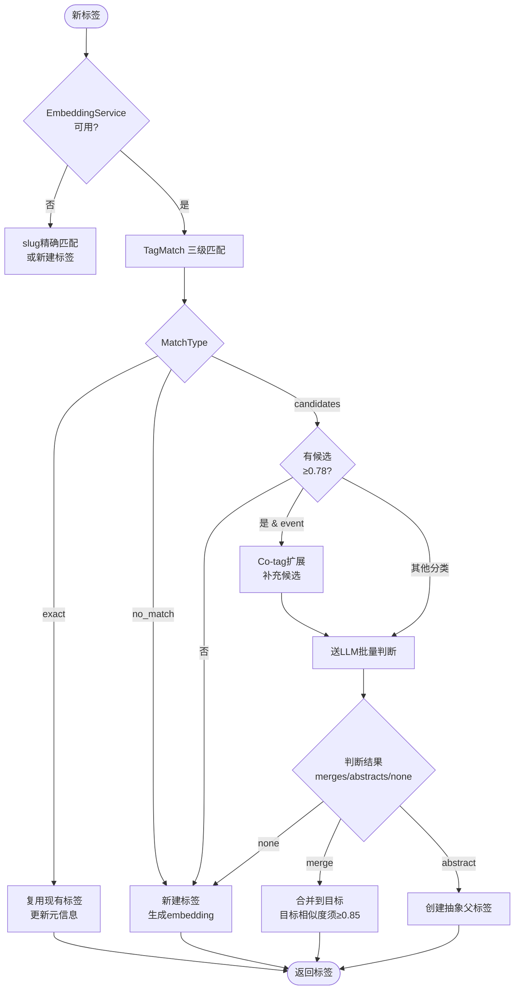
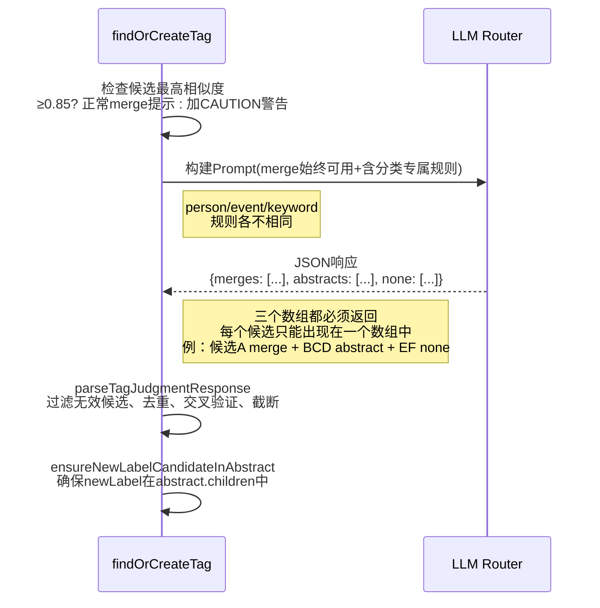
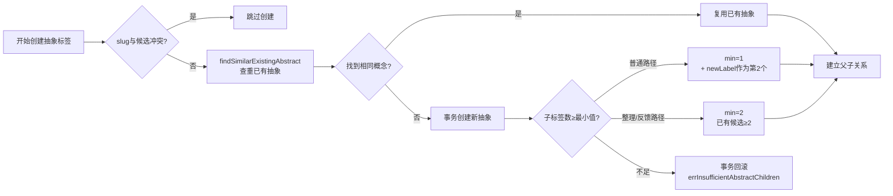
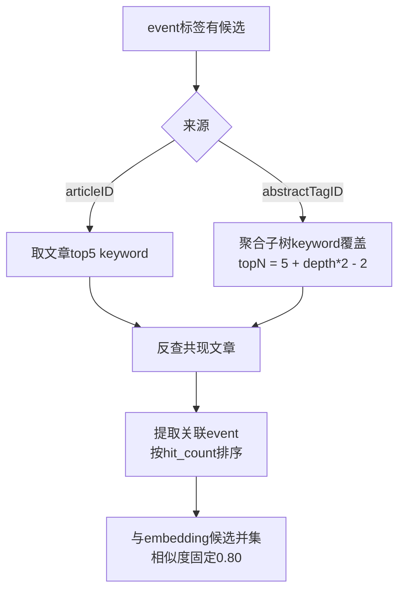
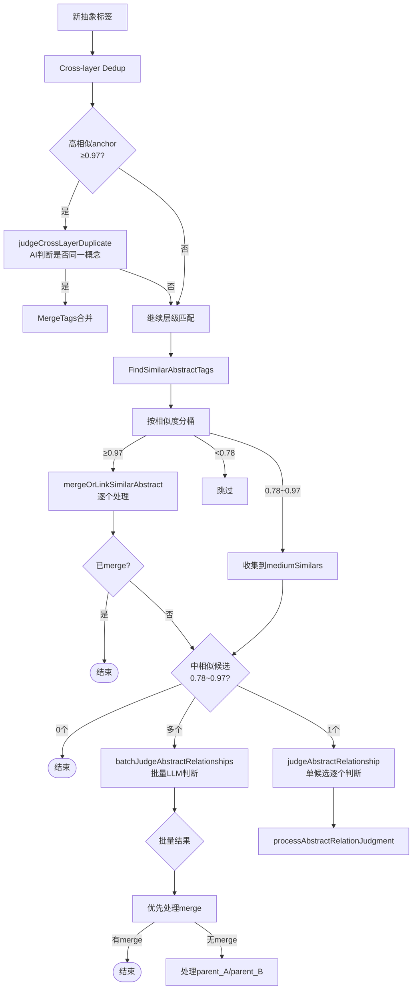
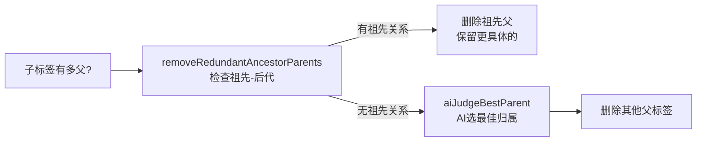
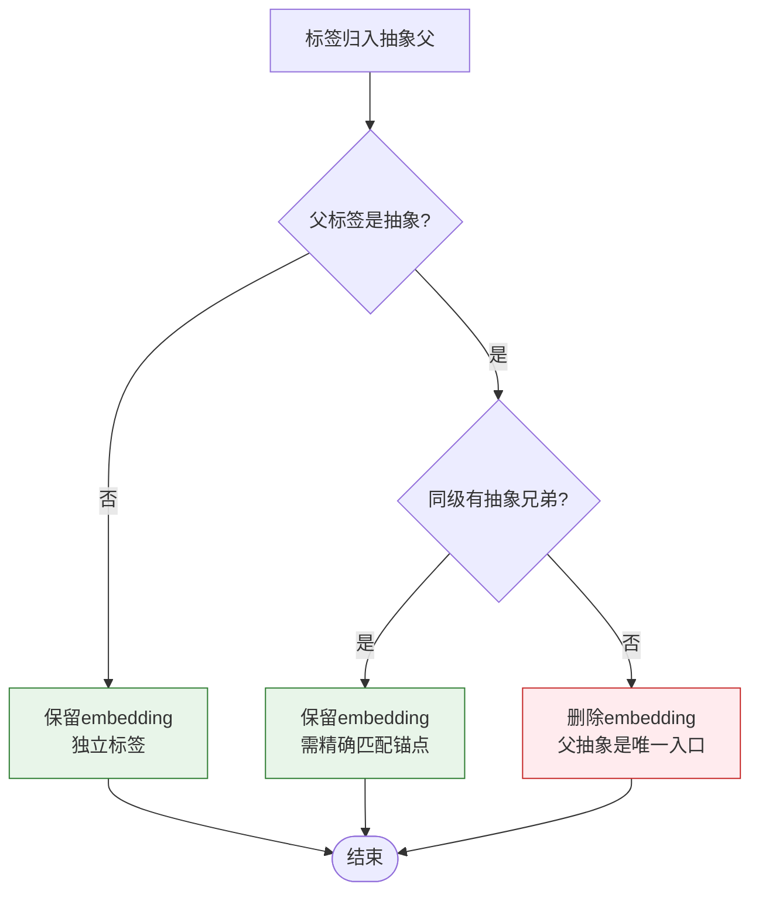
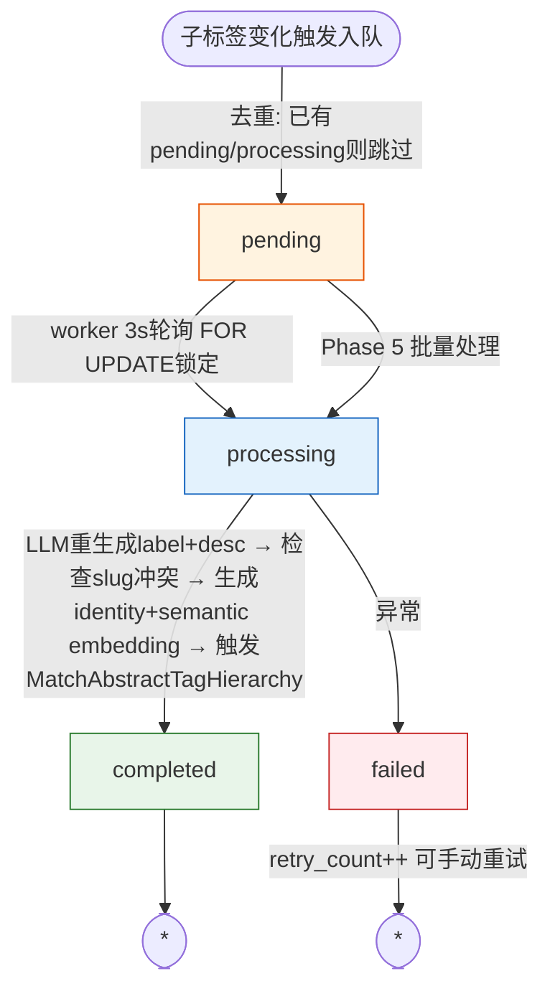
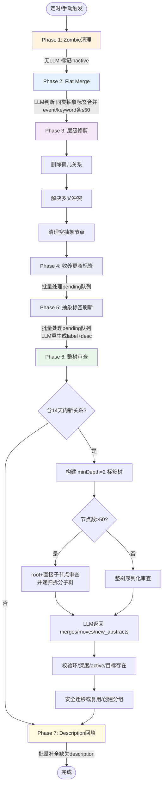

# 打标签流程全景说明

> **版本**：基于 `backend-go/internal/domain/topicanalysis/` 与 `topicextraction/tagger.go` 实际代码整理（2026-04 更新：清理调度器扩展为 7 阶段）  
> **阅读建议**：先看主流程图，再按需深入各子章节

---

## 1. 统一入口：`findOrCreateTag`

**触发场景**：文章/摘要生成标签、手动整理、叙事反馈等

```go
输入: tag topictypes.TopicTag, source string, articleContext string, articleID uint
输出: *models.TopicTag  (复用现有 / 新建 / 归入抽象)
```

### 主流程



---

## 2. Embedding 三级匹配：`TagMatch`

| 级别 | 匹配方式 | 阈值 | 行为 |
|------|----------|------|------|
| **L1** | slug 精确匹配 | — | 直接复用 |
| **L1** | 别名(alias)匹配 | — | 直接复用 |
| **L2** | embedding 相似搜索 | ≥0.97 | 自动复用(Exact) |
| **L2** | embedding 相似搜索 | 0.78~0.97 | 送LLM判断(Candidates) |
| **L2** | embedding 相似搜索 | <0.78 | 新建标签(No Match) |

---

## 3. LLM 批量判断：`callLLMForTagJudgment`

**输入**：候选列表(≤8个/批)、新标签名、分类、叙事上下文  
**输出**：`tagJudgment` (merges / abstracts / none 三个数组，每个候选必须且只能出现在一个数组中)



### Prompt 标签上下文

所有标签判断类 prompt 统一通过 `formatTagPromptContext` 补充标签上下文：普通字段包含 `description`，人物标签还会追加 `metadata` 中的 `country / organization / role / domains`。这些结构化人物属性会进入 merge、abstract、收养更窄标签、多父冲突、层级判断、跨层去重、树审查、flat merge 与抽象标签刷新等 prompt，避免只靠姓名和 embedding 相似度误判不同人物为同一人。

### 判断规则速查

| 分类 | Merge条件 | Abstract条件 |
|------|-----------|--------------|
| **person** | 同一人物不同称谓 | 共享身份/机构/领域 |
| **event** | 同一事件不同描述 | 因果关联或同一事件链 |
| **keyword** | 同义词/翻译 | 同一具体领域直接相关 |

---

## 4. 抽象标签创建：`processAbstractJudgment`

**关键保护机制**：



**异步副作用**：
- 生成 `identity` + `semantic` embedding
- 触发 `MatchAbstractTagHierarchy`
- `EnqueueAdoptNarrower` 入队收养更窄标签（异步批量处理，见第10节）
- 入队 `abstract_tag_update_queues`

---

## 5. Event 标签 Co-tag 扩展

**目的**：用文章 keyword 反查共现 event，补充 embedding 召回遗漏



---

## 6. 抽象层级匹配：`MatchAbstractTagHierarchy`

**触发**：新抽象标签创建后、刷新队列完成后



**LLM 调用优化**：中等相似度候选（0.78~0.97）不再逐个调用 LLM，而是打包一次性 `batchJudgeAbstractRelationships`，仅在单候选时 fallback 到 `judgeAbstractRelationship`。

---

## 7. 父子链接与多父冲突

### `linkAbstractParentChild` 保护

| 检查项 | 失败行为 |
|--------|----------|
| 循环检测 | 返回错误 |
| 深度限制(≤4条边，常量 `maxHierarchyDepth`) | 触发AI建议替代位置 |
| 已存在关系 | 静默跳过 |

### `resolveMultiParentConflict`



---

## 8. Embedding 保留策略



**动态补回**：当普通标签突然获得抽象兄弟时，`enqueueEmbeddingsForNormalChildren` 异步补生成 embedding。

---

## 9. 抽象标签刷新队列

**触发时机**：
- `new_child_added` — `ExtractAbstractTag` 完成
- `hierarchy_linked` — 建立抽象父子关系
- `tag_merged` — 合并到抽象标签
- `adopted_narrower_children` — 收养更窄子标签

**批量处理**：除了实时队列 worker（3s 轮询）外，`TagHierarchyCleanupScheduler` Phase 5 会批量处理所有 pending 的刷新任务，确保整树审查前抽象标签的 label/description 已更新。



> 核心文件: `abstract_tag_update_queue.go`、`queue_batch_processor.go`

---

## 10. 收养更窄标签队列：`adopt_narrower_queues`

**目的**：新抽象标签创建后，异步查找语义更窄的已有抽象标签并收养为子标签。通过队列去重 + 批量 LLM 判断，大幅减少 AI 调用次数。

**触发来源**：

| 来源 | source 标记 | 文件 |
|------|------------|------|
| `processAbstractJudgment` 新建抽象 | `processAbstractJudgment` | `abstract_tag_service.go` |
| `processAbstractJudgment` 复用已有抽象 | `processAbstractJudgment_reuse` | `abstract_tag_service.go` |
| `createAbstractTagDirectly` Phase 6 整树审查 | `createAbstractTagDirectly` | `hierarchy_cleanup.go` |

**批量处理**：除了实时队列 worker（5s 轮询）外，`TagHierarchyCleanupScheduler` Phase 4 会批量处理所有 pending 的收养任务，确保整树审查前窄概念标签已挂到对应抽象节点下。

### 队列流程

```mermaid
flowchart TD
    TRIGGER([抽象标签创建/复用]) --> EQ[EnqueueAdoptNarrower<br/>去重: 已有pending/processing则跳过]
    EQ --> PENDING[pending]
    PENDING --> |worker 5s轮询 FOR UPDATE锁定| PROCESSING[processing]
    PENDING --> |Phase 4 批量处理| PROCESSING
    PROCESSING --> EXEC[adoptNarrowerAbstractChildren]
    
    EXEC --> SEARCH[embedding相似搜索<br/>找同类抽象标签]
    SEARCH --> FILTER{过滤<br/>similarity ≥ LowSimilarity?}
    FILTER -->|无候选| COMPLETED[completed]
    FILTER -->|有候选eligible| BATCH
    
    BATCH[batchJudgeNarrowerConcepts<br/>批量LLM判断]
    Note right of BATCH | 旧: 逐候选调LLM → N次调用<br/>新: 打包一次LLM → 1次调用
    BATCH --> LINK[reparentOrLinkAbstractChild<br/>逐个建立父子关系]
    LINK --> |有收养| ENQUEUE2[入队抽象标签刷新<br/>adopted_narrower_children]
    LINK --> COMPLETED
    ENQUEUE2 --> COMPLETED
    
    PROCESSING --> |异常/panic| FAILED[failed]
    FAILED --> |retry_count++ 可手动重试| DONE1([*])
    COMPLETED --> DONE2([*])

    style PENDING fill:#fff3e0,stroke:#e65100
    style PROCESSING fill:#e3f2fd,stroke:#1565c0
    style COMPLETED fill:#e8f5e9,stroke:#2e7d32
    style FAILED fill:#ffebee,stroke:#c62828
    style BATCH fill:#e8eaf6,stroke:#283593
```

### 批量判断：`batchJudgeNarrowerConcepts`

将一个抽象标签的所有候选打包给 LLM，一次返回哪些是更窄概念：

```
输入: parentTag, candidates []TagCandidate (已过滤 LowSimilarity)
输出: narrowerIDs []uint (被判定为更窄的候选Tag ID列表)

特殊: 单候选时走 aiJudgeNarrowerConcept 逐个判断，保持向后兼容
      多候选时构建列表式 prompt，LLM 返回 {narrower_ids: [1,3,...]}
```

**LLM 调用优化**：假设 1 个抽象标签有 5 个候选 → 旧方案 5 次 `adopt_narrower_abstract` → 新方案 1 次 `adopt_narrower_abstract_batch`。

**去重保护**：PostgreSQL 部分唯一索引 `idx_adopt_narrower_active ON adopt_narrower_queues (abstract_tag_id) WHERE status IN ('pending', 'processing')`，同一标签不会有多个活跃任务。

> 核心文件: `adopt_narrower_queue.go`、`adopt_narrower_queue_handler.go`、`queue_batch_processor.go`  
> API: `GET /api/embedding/adopt-narrower/status`、`POST /api/embedding/adopt-narrower/retry`

---

## 11. 核心方法速查

| 方法 | 文件 | 输入 | 输出 | 一句话职责 |
|------|------|------|------|-----------|
| `findOrCreateTag` | `topicextraction/tagger.go` | tag, source, context, articleID | *TopicTag | **统一入口** |
| `TagMatch` | `topicanalysis/embedding.go` | label, category, aliases | TagMatchResult | **三级匹配** |
| `callLLMForTagJudgment` | `topicanalysis/abstract_tag_judgment.go` | candidates, newLabel, category, context | *tagJudgment | **LLM判断** |
| `processJudgment` | `topicanalysis/abstract_tag_service.go` | judgment, candidates, newLabel | TagExtractionResult | **结果处理** |
| `processAbstractJudgment` | `topicanalysis/abstract_tag_service.go` | candidates, judgment, newLabel, category | AbstractResult | **创建抽象标签** |
| `MatchAbstractTagHierarchy` | `topicanalysis/abstract_tag_hierarchy.go` | abstractTagID | - | **层级匹配** |
| `linkAbstractParentChild` | `topicanalysis/abstract_tag_hierarchy.go` | childID, parentID | error | **建立父子关系** |
| `resolveMultiParentConflict` | `topicanalysis/abstract_tag_hierarchy.go` | childID | bool | **解决多父冲突** |
| `ExpandEventCandidatesByArticleCoTags` | `topicanalysis/cotag_expansion.go` | articleID/abstractTagID | []TagCandidate | **co-tag扩展** |
| `refreshAbstractTag` | `topicanalysis/abstract_tag_update_queue.go` | abstractTagID | error | **刷新label/desc/emb** |
| `MergeTags` | `topicanalysis/embedding.go` | sourceID, targetID | error | **合并标签** |
| `adoptNarrowerAbstractChildren` | `topicanalysis/abstract_tag_hierarchy.go` | abstractTagID | error | **批量收养更窄标签** |
| `batchJudgeNarrowerConcepts` | `topicanalysis/abstract_tag_judgment.go` | parentTag, candidates | []uint | **批量LLM判断更窄** |
| `batchJudgeAbstractRelationships` | `topicanalysis/abstract_tag_judgment.go` | tagA, candidates | []batchAbstractRelationResult | **批量LLM判断抽象关系** |
| `EnqueueAdoptNarrower` | `topicanalysis/adopt_narrower_queue.go` | abstractTagID, source | - | **入队收养任务** |
| `ProcessPendingAdoptNarrowerTasks` | `topicanalysis/queue_batch_processor.go` | - | int | **批量处理pending收养任务** |
| `ProcessPendingAbstractTagUpdateTasks` | `topicanalysis/queue_batch_processor.go` | - | int | **批量处理pending抽象标签刷新** |
| `BackfillMissingDescriptions` | `topicextraction/description_backfill.go` | - | int | **批量补全缺失description** |
| `formatTagPromptContext` | `topicanalysis/tag_prompt_context.go` | TopicTag | string | **统一生成LLM标签上下文，人物包含结构化属性** |

---

## 12. 标签清理机制

### 实时清理：`cleanupOrphanedTags`

文章重新打标签后，旧标签若不再被任何 `article_topic_tags` 或 `ai_summary_topics` 引用，直接删除（含 embedding）。`article_tagger.go:369`

### 深度限制：`maxHierarchyDepth`

深度限制统一使用常量 `maxHierarchyDepth = 4`（4条边，即5个节点）。所有创建抽象父子关系的路径都必须调用 `checkDepthLimit(tx, parentID, childID)` 检查，该函数计算 `getAbstractSubtreeDepth(child) + getTagDepthFromRoot(parent) + 1` 是否超过限制。

涉及的代码路径：
- `linkAbstractParentChild` — `abstract_tag_hierarchy.go`
- `reparentOrLinkAbstractChild` — `abstract_tag_judgment.go`
- `processAbstractJudgment` — `abstract_tag_service.go`
- `validateTreeReviewMove` / `executeTreeReviewMove` — `hierarchy_cleanup.go`
- `validateAndCreateReviewAbstract` — `hierarchy_cleanup.go`
- `createAbstractTagDirectly` — `hierarchy_cleanup.go`

### 数据清理工具：`cmd/fix-hierarchy-depth`

用于修复历史超限数据。从每个标签出发沿 parent 方向 DFS，如果任何路径超过4条边，断开该标签的所有父关系使其成为根节点。

```bash
cd backend-go
go run ./cmd/fix-hierarchy-depth --dry-run        # 预览
go run ./cmd/fix-hierarchy-depth --dry-run=false   # 执行
```

### 定时调度：`TagHierarchyCleanupScheduler`（7 阶段）



| 阶段 | 文件 | LLM? | 条件 |
|------|------|-------|------|
| Phase 1 Zombie | `tag_cleanup.go` `CleanupZombieTags` | 否 | age>7d + 无关系 + 无文章/摘要引用 |
| Phase 2 Flat Merge | `tag_cleanup.go` `ExecuteFlatMerge` | 是 | 同类 abstract 标签去重 |
| Phase 3 层级修剪 | `tag_cleanup.go` 三个函数 | 否 | 孤儿关系 / 多父 / 空抽象 |
| Phase 4 收养更窄标签 | `queue_batch_processor.go` `ProcessPendingAdoptNarrowerTasks` | 是 | 处理 pending 的 adopt_narrower 队列任务 |
| Phase 5 抽象标签刷新 | `queue_batch_processor.go` `ProcessPendingAbstractTagUpdateTasks` | 是 | 处理 pending 的 abstract_tag_update 队列任务 |
| Phase 6 整树审查 | `hierarchy_cleanup.go` `ReviewHierarchyTrees` | 是 | 含 windowDays 内新关系的 minDepth=2 标签树 |
| Phase 7 Description回填 | `description_backfill.go` `BackfillMissingDescriptions` | 是 | active 标签中 description 为空的，从关联文章获取上下文生成 |

核心文件: `jobs/tag_hierarchy_cleanup.go`（调度器）、`topicanalysis/tag_cleanup.go`（Phase 1-3）、`topicanalysis/queue_batch_processor.go`（Phase 4-5）、`topicanalysis/hierarchy_cleanup.go`（Phase 6）、`topicextraction/description_backfill.go`（Phase 7）

Phase 4-5 在整树审查前执行：先收养更窄标签挂到对应抽象节点下，再刷新抽象标签的 label/description，确保审查时层级结构已经是最新的。

Phase 6 不再只做"深度压缩"。它会把 `event`、`keyword`、`person` 三类抽象树序列化给 LLM 审查子标签归属是否合理。LLM 可同时返回三种操作：

- `merges`：合并树中语义重复的抽象标签（source 合并进 target），消除因多父关系导致的同一标签在树中重复出现。树的根节点不允许作为 merge source。
- `moves`：把标签迁移到树中已有父节点，或 `to_parent=0` 让其脱离为根节点。树的顶级根节点不允许被 move 为其他节点的子节点。
- `new_abstracts`：建议新的分组；系统先复用已有相似抽象或 slug 命中抽象，找不到才创建新抽象。

执行顺序：先 merges（消除重复节点）→ 再 moves（调整归属）→ 最后 new_abstracts（新建分组）。

执行 merge/move 前会校验标签存在、active、目标在当前审查树中、不会成环、深度不超过 4。非 detach 迁移在事务中先创建新父关系，再删除旧父关系；失败时保留旧关系，避免产生孤儿标签。大树会先审查 `root + 直接子节点`，再递归审查子树，防止第一层错挂漏审。

此外，根抽象标签的 label 受保护：`refreshAbstractTag` 不会修改根节点的 label 和 slug，仅允许更新 description。

Phase 7 批量查询 active 标签中 description 为空的记录，通过关联的 `article_topic_tags` 获取最近 3 篇文章标题作为上下文，调用 LLM 生成 description。每次最多处理 50 个标签，间隔 500ms。

---

## 总结

```
新标签 → Embedding三级匹配 → 有候选则LLM判断(merges/abstracts/none三个必填数组)
                                     ↓
                          event标签额外走co-tag扩展补充候选
                                     ↓
               LLM输出三个数组: merges(同概念merge) + abstracts(相关但不同) + none(无关/独立)
                                     ↓
               merge: processJudgment验证目标相似度≥0.85 → 合并
               abstract: 查重 → 子标签数保护 → 事务落库
               none: 未放入任何数组的候选自动补入none
                                     ↓
               异步: 生成embedding → 层级匹配 → EnqueueAdoptNarrower入队 → 入队刷新
                                     ↓
               定时清理(7阶段): zombie → flat merge → 层级修剪 → 收养窄标签 → 抽象刷新 → 整树审查 → description回填
                                     ↓
               收养队列: 5s轮询 + Phase4批量处理 → batchJudgeNarrowerConcepts批量LLM → 收养更窄标签
                                     ↓
               层级匹配: 跨层去重 + 深度限制 → AI判断父子
                                     ↓
               链接成功: 解决多父冲突 → embedding动态管理 → 父标签入队刷新
```
