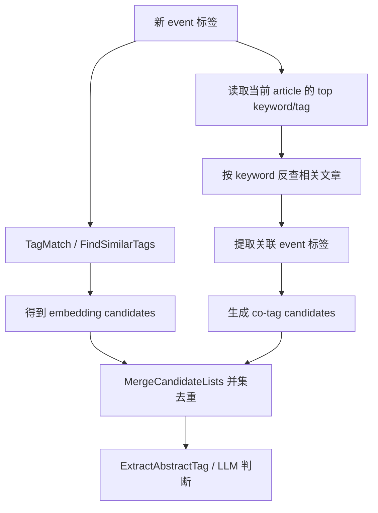
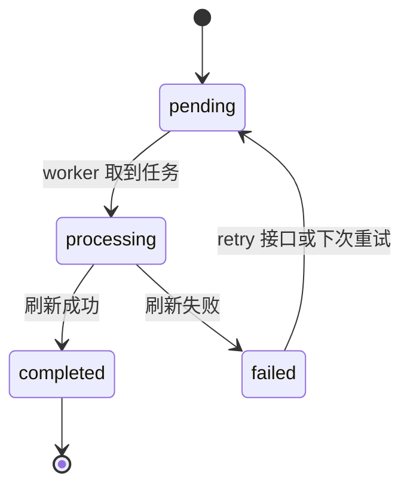

# Topic Graph 前端说明

## 这份文档讲什么

这份文档只讲前端的 Topic Graph 页面，也就是 `/topics` 这条路由背后的页面结构、数据流和与后端的对接方式。

它回答这些问题：

- 主题图谱页由哪些组件组成
- 页面初始加载时会拉哪些接口
- 选中 topic、热点标签、digest、文章预览时状态怎么流转
- AI analysis 面板是怎么轮询和回填的

## 页面入口

- 路由页：`front/app/pages/topics.vue`
- 页面主容器：`front/app/features/topic-graph/components/TopicGraphPage.vue`
- API 边界：`front/app/api/topicGraph.ts`

`topics.vue` 本身很薄，只负责挂载 `TopicGraphPage`。

## 当前页面结构

Topic Graph 页面当前不是单一图谱画布，而是一个多区块工作台。

### 主体组件

- `TopicGraphPage.vue`：页面状态中心，负责 orchestration
- `TopicGraphHeader.vue`：顶部控制区，切换 `daily/weekly`、日期、刷新
- `TopicGraphCanvas.client.vue`：3D 图谱画布，只负责展示和节点点击事件
- `TopicGraphSidebar.vue`：右侧 topic 详情栏
- `TopicTimeline.vue`：中下方时间线 / digest 列表
- `TopicGraphFooterPanels.vue`：底部分析与历史面板
- `ArticleContentView.vue`：文章预览弹层内容，直接复用主阅读组件

### 相关子组件

- `TopicAnalysisPanel.vue`
- `TopicAnalysisTabs.vue`
- `TopicAIAnalysisPanel.vue`
- `EventAnalysisView.vue`
- `PersonAnalysisView.vue`
- `KeywordAnalysisView.vue`
- `KeywordCloud.vue`
- `TopicTimeline.vue` / `TimelineItem.vue` / `TimelineHeader.vue`

## 当前数据来源

Topic Graph 的前端数据面主要集中在 `useTopicGraphApi()`。

### 图谱与详情

- `getGraph(type, date)` -> `/topic-graph/:type`
- `getTopicDetail(slug, type, date)` -> `/topic-graph/topic/:slug`
- `getTopicsByCategory(type, date)` -> `/topic-graph/by-category`
- `getDigestsByArticleTag(slug, type, date, limit)` -> `/topic-graph/tag/:slug/digests`

### analysis

- `getTopicAnalysis(...)` -> `/topic-graph/analysis`
- `getAnalysisStatus(...)` -> `/topic-graph/analysis/status`
- `rebuildTopicAnalysis(...)` -> `/topic-graph/analysis/rebuild`
- `retryTopicAnalysis(...)` -> `/topic-graph/analysis/retry`

### 相关文章

- `getTopicArticles(...)` -> `/topic-graph/topic/:slug/articles`
- `getPendingArticlesByTag(...)` -> `/topic-graph/tag/:slug/pending-articles`

另外文章预览不会走 topic graph API，而是复用 `useArticlesApi().getArticle(articleId)` 拉标准 article 详情。

补充：article tags 的生成已经改成“主路径 + 兜底”模式：普通 refresh 文章会尽快打标签，`Firecrawl + 自动补全` 的文章会在补全完成后打标签，summary 阶段只补漏。

## 首次进入页面时会发生什么

场景：用户第一次打开 `/topics`。

链路：

1. `TopicGraphPage` 初始化默认状态：
   - `selectedType = daily`
   - `selectedDate = 今天`
2. 调用 `loadGraph()`
3. `getGraph(selectedType, selectedDate)` 拉图谱主体数据
4. 图谱成功后：
   - `graphPayload` 写入
   - 默认选中 `top_topics[0]`
   - 以第一个 topic 的 `slug` 继续加载详情
5. 同时并行触发 `loadHotspots()`
6. `getTopicsByCategory(...)` 拉热点标签分组数据
7. 如果默认 topic 存在，再调用 `loadTopicDetail(slug)` 拉右侧详情与时间线数据

也就是说，首屏其实至少有两组请求并行：

- 图谱主体
- 热点分类

然后再串行补 topic detail。

## 页面核心状态怎么分层

Topic Graph 当前的状态主源放在 `TopicGraphPage.vue`，不是 Pinia。

### 图谱主状态

- `selectedType`
- `selectedDate`
- `graphPayload`
- `loadingGraph`
- `notice`

### 当前选中对象

- `selectedTopicSlug`
- `selectedCategory`
- `selectedKeywordSlug`
- `detail`

### 热点与 digest 选择

- `hotspotData`
- `selectedHotspotTag`
- `hotspotDigests`
- `selectedDigestId`
- `previewDigestId`
- `showLowQualityTags`

### 文章预览

- `selectedPreviewArticle`
- `previewArticles`
- `loadingPreviewArticle`

### AI analysis 状态

页面内和底部面板内都各自维护了 analysis 相关状态。

- `TopicGraphPage.vue` 里有一组页面级 analysis 状态
- `TopicGraphFooterPanels.vue` 里还有按类型分开的 `analysisDataByType / statusByType / progressByType`

当前真实实现里，底部面板这套是更贴近实际展示链路的主实现。

## 视图模型层做了什么

原始图谱 payload 不直接喂给画布，而是先经过：

- `front/app/features/topic-graph/utils/buildTopicGraphViewModel.ts`

它主要做这些转换：

- 归一化 topic category
- 给节点补 `size` 和 `accent`
- 优先根据 `quality_score` 推导节点大小和透明度，质量分缺失时再回退旧的 `weight`
- 过滤掉权重过低的 edge（`weight < 0.35`）
- 推导 `featuredNodeIds`
- 推导 trunk / branch / peripheral 三层视觉层级
- 生成页面头部统计文案

因此 `TopicGraphCanvas.client.vue` 更像是一个纯显示组件，视觉分层逻辑已经前移到 view model。

## 具体交互用例

### 用例 1：点击图谱节点

场景：用户在 3D 图谱里点了一个 topic node。

链路：

1. `TopicGraphCanvas.client.vue` 触发 `nodeClick`
2. `TopicGraphPage.handleNodeClick()` 接收 node
3. 只处理 `kind === 'topic'` 的节点
4. 更新 `selectedCategory`
5. 调用 `loadTopicDetail(node.slug)`
6. 右侧详情栏、时间线、底部分析面板一起切到这个 topic

这说明画布只负责“发出点击事件”，真正的状态切换都在页面容器层完成。

### 用例 2：点击热点标签

场景：用户从热点分类区点一个标签。

链路：

1. `handleTagSelect(slug, category)` 更新：
   - `selectedCategory`
   - `selectedTopicSlug`
   - `selectedHotspotTag`
2. 调用 `loadHotspotDigests(slug)`
3. 通过 `/topic-graph/tag/:slug/digests` 走反查链路：`tag -> articles -> digests`
4. 同时调用 `loadTopicDetail(slug)` 更新 sidebar 详情
5. 时间线区域优先展示 `hotspotDigests` 转换后的 `hotspotTimelineItems`

这里的 digest tags 现在不是 digest 自己的 summary topics，而是 digest 覆盖 article 的 `aggregated_tags`。

补充：热点标签分组和 fallback topic 列表现在都优先按 `quality_score` 排序。普通标签如果带 `is_low_quality: true`，默认会被隐藏；抽象标签不受这个默认过滤影响，用户可以通过页面开关显式显示全部标签。

所以热点标签点击后，页面会同时切换两套内容：

- 右侧还是 topic detail
- 中下区域则优先展示“包含这个标签文章的 digest 列表”

补充：标签层级视图里的 tag row 现在也会复用同一条 `handleTagSelect(slug, category)` 链路，所以从层级树里点标签时，也会同步驱动右侧详情栏和下方 timeline，而不是只停留在层级视图内部。

### 用例 3：选择 digest，再打开文章预览

场景：用户从时间线选中一条 digest，再点里面的文章。

链路：

1. `selectedDigestId` 指向当前 digest
2. `selectedDigest` 计算属性会把 digest 转成 `TimelineDigestSelection`
3. 如果当前来自热点 digests，会优先用 `matched_articles`
4. 如果当前来自 topic detail digests，会和 `detail.articles` 做一次 article id 交集
5. 用户点文章后调用 `openArticlePreview(articleId)`
6. 通过 `articlesApi.getArticle(articleId)` 拉完整 article
7. 弹出 `ArticleContentView`，复用主阅读链路里的：
   - Firecrawl 状态
   - AI 内容整理状态
   - 内容源切换
   - 手动抓取 / 手动整理动作
   - article tags 通用展示

这也是 topic graph 页面和主阅读链路复用最深的一段。

### 用例 4：底部 AI analysis 面板

场景：用户选中 topic 后，希望看人物/事件/关键词分析。

链路：

1. `TopicGraphFooterPanels.vue` 监听 `detail`
2. 基于 `detail.topic.category + kind` 计算当前 `selectedAnalysisType`
3. `loadAnalysis(type)` 先查 `/topic-graph/analysis`
4. 如果已存在结果，直接 parse `payload_json`
5. 如果没有现成结果，则调用 `getAnalysisStatus()`
6. 当状态是：
   - `pending` / `processing`：启动轮询
   - `ready`：重新拉完整 analysis
   - `missing`：必要时触发 `rebuildTopicAnalysis()`
7. 轮询间隔目前是 `1800ms`
8. 完成后把结果按类型写回 `analysisDataByType`

这里有一个当前实现上的现实细节：`TopicGraphFooterPanels.vue` 里分析请求的 `windowType` 目前固定写成了 `daily`，不是完全跟随页面顶部的 `selectedType`。

## 当前 UI 分区职责

### Header

- 切换 `daily/weekly`
- 选择锚点日期
- 刷新当前图谱

### Canvas

- 展示 topic/feed 节点和 topic_topic / topic_feed 边
- 根据 `highlightedNodeIds` 和 `relatedEdgeIds` 做高亮
- 不自己持有业务状态

### Sidebar

- 展示当前 topic 的：
  - 基础信息
  - 相关文章
  - 相关标签
  - 相关 topic
  - search/app links

### Timeline

- 展示 topic 关联 digest 或热点反查 digest
- 支持 timeline filters
- 选择 digest 后驱动底部与预览区域
- digest 卡片里的 tags 使用 `aggregated_tags`，表达“这份 digest 覆盖到的 article tag 索引”
- digest 下单篇文章打开后，文章弹窗展示 article 自身 tags，并对当前选中 topic 做高亮

### Footer Panels

- AI analysis 面板：根据 topic category 自动加载对应类型的分析（事件 / 人物 / 关键词）
- 历史面板：展示分析历史记录
- 轮询机制：分析请求 pending/processing 时每 1800ms 轮询一次，完成后停止
- 每种分析类型独立缓存（`analysisDataByType / statusByType / progressByType`）

## 当前与 Pinia 的关系

Topic Graph 页面目前主要是页面内状态管理，不是 store 驱动页面。

但仓库里还有一个：

- `front/app/stores/aiAnalysis.ts`

它也封装了 topic analysis 的缓存和轮询逻辑，不过当前 `TopicGraphPage` / `TopicGraphFooterPanels` 这条主渲染链并没有直接依赖它。

也就是说，现在 topic analysis 在前端存在两套实现思路：

- 页面组件内直接管理
- `aiAnalysis` store 形式管理

如果后续继续收敛，这会是一个值得清理的边界点。

## 当前实现里容易忽略的点

- `/topics` 已经是独立页面，不属于主阅读页三栏壳
- 图谱页不是只看图，还串了热点标签、digest 时间线、analysis 和文章预览
- 文章预览复用 `ArticleContentView`，所以 topic graph 自动继承了 Firecrawl / 内容补全能力
- 热点标签点击后，中下区域优先显示反查 digest，不再只显示当前 topic detail 自带 summaries
- view model 会过滤低权重边，因此后端返回的 edge 不一定都会进最终画布

## 标签质量评分与低质量标签

### 概述

每个标签有一个 0–1 的 `quality_score`，由后端定时任务 `tag_quality_score` 计算。当 `quality_score < 0.3` 且标签非抽象时，该标签被标记为"低质量"（`is_low_quality = true`）。

### 质量分数计算流程

代码位置：`backend-go/internal/domain/topicextraction/quality_score.go`

#### 第一步：采集原始指标

对每个 `status = 'active'` 的标签，通过 SQL 聚合四项原始指标：

| 指标 | SQL 来源 | 含义 |
|------|----------|------|
| `article_count` | `COUNT(DISTINCT article_topic_tags.article_id)` | 该标签关联了多少篇文章 |
| `feed_diversity` | `COUNT(DISTINCT articles.feed_id)` | 这些文章来自几个不同的 feed |
| `avg_cooccurrence` | `AVG(同一篇文章上的其他标签数)` | 该标签平均和多少其他标签共现 |
| `semantic_match_avg` | 当前固定为 0（预留） | 语义匹配置信度 |

注意：`semantic_match_avg` 当前 SQL 硬编码为 `0 AS semantic_match_avg`，后续代码中如果该值为 0 则回退使用默认常量 `0.7`。

#### 第二步：百分位排名（percentile ranking）

对前三项指标（article_count、avg_cooccurrence、feed_diversity），分别在全量标签中计算百分位排名：

```
percentileRank = 该标签超过的标签数 / 总标签数
```

例如有 100 个标签，某标签的 article_count 排在第 80 名，则 `freqPct = 0.80`。

- 标签总数 < 3 时，所有百分位直接返回 0.5
- 标签不在统计列表中时，也返回 0.5

#### 第三步：加权合成质量分数

```go
// 实际权重
quality_score = 0.4 * freqPct + 0.2 * coocPct + 0.2 * feedDivPct + 0.2 * semanticPct
```

| 维度 | 权重 | 原始数据 | 排名方式 |
|------|------|----------|----------|
| 频率 | **40%** | `article_count` | 百分位排名 |
| 共现度 | 20% | `avg_cooccurrence` | 百分位排名 |
| Feed 多样性 | 20% | `feed_diversity` | 百分位排名 |
| 语义质量 | 20% | 当前固定 `0.7` | 直接使用 |

频率权重最高，意味着被更多文章引用的标签质量更高。

#### 第四步：抽象标签的分数继承

抽象标签（`is_abstract = true`）不直接计算分数，而是由其子标签加权平均得出：

```
abstract_score = Σ(子标签.quality_score × 子标签.article_count) / Σ(子标签.article_count)
```

子标签文章数作为权重，文章越多的子标签对父标签分数贡献越大。无文章记录的子标签保底权重为 1。

#### 第五步：无文章的标签

如果一个标签没有任何关联文章（`article_count = 0`），其 `quality_score` 直接设为 `0`。

### 低质量标签判定标准

```go
// 后端在构建 API 响应时动态标记，不持久化到数据库
IsLowQuality = (Source != "abstract") && (QualityScore < 0.3)
```

即同时满足两个条件：
1. **非抽象标签** — 标签来源不是 abstract（抽象标签豁免）
2. **质量分数低于 0.3** — 综合排名在 30% 以下

典型的低质量标签特征：文章关联少、feed 来源单一、很少和其他标签共现。

### 前端行为

- **3D 拓扑图**：低质量节点默认不渲染，用户可通过节点旁的眼睛图标手动显示
- **热点题材列表**：低质量标签排在底部，显示"低质量"文字标记
- **标签层级视图**：低质量标签显示橙色"低质量"徽章

### 相关代码

| 文件 | 职责 |
|------|------|
| `backend-go/internal/domain/topicextraction/quality_score.go` | 质量分数计算核心逻辑 |
| `backend-go/internal/jobs/tag_quality_score.go` | 定时任务调度，默认每小时运行一次 |
| `backend-go/internal/domain/topicgraph/service.go` | 在 API 响应中标记 `is_low_quality` |
| `backend-go/internal/domain/topicanalysis/abstract_tag_crud.go` | 层级 API 响应中标记 `is_low_quality`（`GetTagHierarchy`） |
| `front/app/features/topic-graph/components/TopicGraphPage.vue` | 拓扑图默认隐藏、热点列表排序 |
| `front/app/features/topic-graph/components/TagHierarchyRow.vue` | 标签层级行中的"低质量"徽章 |

## 标签匹配与抽象层级

### 概述

新标签从文章/摘要中提取后，经过 `findOrCreateTag` 的统一匹配流程决定是复用、归入抽象、还是新建。匹配结果分为三种：`exact`（完全匹配）、`candidates`（有相似候选）、`no_match`（无匹配）。当存在候选时，系统分批将候选送 LLM 进行 per-candidate 判断，由 LLM 决定每个候选的 merge/abstract/none 动作。前批判断结果作为后续批次的上下文，保持一致性。抽象标签建立后还会触发层级匹配，形成多级分类树。

核心代码：`backend-go/internal/domain/topicextraction/tagger.go`、`backend-go/internal/domain/topicanalysis/abstract_tag_service.go`（主流程）、`backend-go/internal/domain/topicanalysis/abstract_tag_judgment.go`（LLM 判断）、`backend-go/internal/domain/topicanalysis/abstract_tag_hierarchy.go`（层级匹配）、`backend-go/internal/domain/topicanalysis/embedding.go`

### 统一匹配流程

`findOrCreateTag` 不再区分高/中/低阈值，统一由 LLM per-candidate 判断：

```
新标签 → TagMatch() 生成 embedding → FindSimilarTags 搜索
    ↓
┌──────────────────────────────────────────────────────────────────┐
│ exact（slug/别名完全匹配）        → 复用现有标签，更新元信息        │
│ 有候选 >= 0.78                   → 分批送 LLM per-candidate 判断:  │
│                                    merge: 合并到 LLM 指定的候选    │
│                                    abstract: 创建抽象标签+子标签   │
│                                    none: 候选独立，创建新标签      │
│                                    多批处理，前批结果作为下批上下文 │
│ 无候选或全部 < 0.78              → 全新标签，生成 embedding        │
└──────────────────────────────────────────────────────────────────┘
```

阈值可在 `embedding_config` 表配置，默认值：

| 阈值 | 默认值 | 含义 |
|------|--------|------|
| `LowSimilarity` | 0.78 | 候选搜索下限 |

### Event 标签的 Co-tag 扩展

事件标签在 `candidates` 分支里，除了 embedding 检索，还会额外走一层 co-tag 扩展，再把两路候选并集后统一送进 LLM 判断。

#### 普通 event 标签

来自文章打标签链路的 event 标签，会用当前文章上已经存在的高分 keyword/tag 作为 co-tag 起点：



#### 抽象 event 标签

当 LLM 选择 `abstract` 并创建新的抽象 event 标签后，系统会对这个新抽象再补一次 co-tag 扩展。这里不再依赖单篇文章，而是聚合整棵子树的 keyword 覆盖：

1. 收集抽象标签所有后代 event 子标签
2. 统计这些子标签覆盖文章中的 keyword 共现情况
3. 按子标签覆盖数排序，取 `topN = min(5 + (subtreeDepth - 1) * 2, 15)`
4. 用这些 keyword 反查关联文章，再提取 event 标签候选
5. 与已有 candidates 并集后，再次走 `ExtractAbstractTag`

这样做的目的是让新抽象标签在刚创建时，就能拿到“同一事件簇里经常一起出现的 event 候选”，减少只靠初始 embedding 命中的漏召回。

### Per-candidate 批量判断

当有候选标签（相似度 >= 0.78）时，`callLLMForTagJudgment` 分批将候选送 LLM 判断：

1. 每批最多处理 8 个候选标签
2. LLM 对每个候选独立返回 `action`：`merge`（合并）、`abstract`（创建抽象父标签）或 `none`（无关）
3. `merge` 动作附带 `merge_target` 字段，指定合并到哪个候选
4. `abstract` 动作附带 `merge_label` 字段，作为抽象父标签名称
5. 后续批次通过 `previousResults` 参数接收前批结果，保持判断一致性
6. `processJudgments` 遍历所有判断结果，`selectMergeTarget` 选择最佳合并目标（优先非抽象候选）
7. 若 LLM 返回非数组格式，`parseSingleJudgmentFallback` 兼容处理

### 抽象层级匹配

新抽象标签创建后，`MatchAbstractTagHierarchy` 立即搜索相似抽象标签，建立多级层级：

| 相似度 | 行为 |
|--------|------|
| >= 0.97 | 新抽象成为现有抽象的子标签 |
| 0.78~0.97 | AI 判断谁更宽泛（parent/child），建立关系 |
| < 0.78 | 无操作 |

这一步使得抽象标签可以形成树状层级，例如"编程语言 → 前端框架 → React"。

### 跨层级去重与深度保护（C+D）

现在 `MatchAbstractTagHierarchy` 和 `linkAbstractParentChild` 之间多了一层 C+D 保护，用来解决两类问题：

- 同一棵树不同层级出现重复概念
- 抽象层级无限向下长深

#### C: Cross-layer Dedup

目标仍然是“全树去重”，但实现上不假设树里每个普通节点都有 embedding。当前采用的是“先找锚点，再回查 event”的两段式：

1. 先用新抽象标签自身的 embedding 跑 `FindSimilarTags`，拿到一批高置信 anchor
2. 从这些 anchor 关联的文章里提取 keyword
3. 复用 co-tag 管线反查 event 标签
4. 只保留当前同一棵树里的候选节点
5. 对 shortlist 调用 `judgeCrossLayerDuplicate`
6. 只有 AI 明确判断“两个标签是同一概念”时，才执行 `MergeTags`

也就是说，shortlist 分高不等于直接合并；最终合并一定要经过显式 duplicate 判断。

#### D: Depth Guard

插入新的抽象父子关系前，`linkAbstractParentChild` 会先检查组合深度：

```text
子标签子树深度 + 父标签祖先深度 + 1
```

- 结果 `<= 4`：允许插入
- 结果 `> 4`：拒绝插入

当超过 4 层时，系统会调用 `aiJudgeAlternativePlacement` 给出替代建议，例如：

- 放到更浅层的已有抽象下
- 与某个同义/近义抽象合并
- 放弃这次纵向插入

但 `linkAbstractParentChild` 本身仍然是硬保护，不会在事务里偷偷改写成别的关系。

#### 周期清理里的复用

定时任务 `tag_hierarchy_cleanup` 的 Phase 6（整树审查）会处理 event 树的深层重复和过深层级：

1. BuildTagForest 构建当前 event forest
2. 只处理深度较深的树
3. 复用同一套 cross-layer dedup / depth guard helper
4. 把结果单独记到 `cd_merges_applied`

这样，实时创建链路和周期清理链路不会各自维护两套不同的去重规则。

### 抽象标签子标签数量保护

抽象标签落库前会做最小子标签数保护，避免出现只有一个子标签的抽象节点：

- 普通打标签路径里，`newLabel` 是即将创建的新标签，因此抽象父标签至少要先连上 1 个已有候选；随后新标签会作为第二个子标签挂入抽象父标签。
- 未分类整理、叙事反馈等路径里，`newLabel` 本身已经是候选标签，不会再创建新子标签，因此抽象父标签必须至少能连上 2 个已有候选。
- 如果 LLM 只返回了 sibling，而漏掉当前候选标签，后端会在不与 merge 判断冲突的前提下把当前候选补回 `abstract.children`。
- 如果最终可连接的子标签数仍不足，整个抽象标签创建事务会回滚，不落单子抽象节点。

### Embedding 管理策略

Embedding 的保留/删除直接决定标签能否被未来的相似标签匹配到。策略遵循以下规则：

**抽象标签：始终保留 embedding**

抽象标签代表分类概念，必须保持可被匹配。`MatchAbstractTagHierarchy` 中建立抽象父子关系时**不删除**子抽象标签的 embedding。

**普通标签：按兄弟情况决定**

```
删除 embedding 的条件（同时满足）：
  1. 父标签是抽象标签
  2. 同级没有抽象兄弟标签

保留 embedding 的条件（满足其一）：
  - 父标签不是抽象标签（独立标签）
  - 同级有抽象兄弟标签（需要精确匹配锚点）
```

这个策略的理由：

- **无抽象兄弟时**：父抽象是唯一的匹配入口，普通子标签不需要独立匹配
- **有抽象兄弟时**：普通子标签必须保留 embedding，否则新标签只能匹配到父抽象或错误地匹配到抽象兄弟，导致横向扩容

示例：

```
编程语言（抽象，有 embedding）
├── 前端框架（抽象，有 embedding）     ← 抽象，保留
│   ├── React（普通，无 embedding）    ← 父抽象，无抽象兄弟 → 删除
│   └── Vue（普通，无 embedding）      ← 同上
├── Python（普通，有 embedding）       ← 父抽象，有抽象兄弟"前端框架" → 保留
└── Java（普通，有 embedding）         ← 同上
```

### Embedding 的动态补回

当抽象标签通过 `linkAbstractParentChild` 被链接到另一个抽象下时，父级的普通子标签可能突然获得了抽象兄弟。此时 `enqueueEmbeddingsForNormalChildren` 异步为这些缺少 embedding 的普通子标签补生成 embedding。

场景：Python 先成为"编程语言"的子标签（此时无抽象兄弟，不生成 embedding），之后"前端框架"被链接到"编程语言"下，Python 现在有了抽象兄弟，系统自动补生成 Python 的 embedding。

### 相关代码

| 文件 | 职责 |
|------|------|
| `backend-go/internal/domain/topicextraction/tagger.go` | `findOrCreateTag` 统一匹配主流程，exact/candidates/no_match 三分支 |
| `backend-go/internal/domain/topicanalysis/embedding.go` | `TagMatch`、`FindSimilarTags`、`FindSimilarAbstractTags`、`DeleteTagEmbedding` |
| `backend-go/internal/domain/topicanalysis/abstract_tag_service.go` | `ExtractAbstractTag` 主流程 + 类型定义 |
| `backend-go/internal/domain/topicanalysis/abstract_tag_judgment.go` | LLM 判断（prompt 构建、AI 调用、响应解析） |
| `backend-go/internal/domain/topicanalysis/abstract_tag_hierarchy.go` | `MatchAbstractTagHierarchy`、`linkAbstractParentChild`、`enqueueEmbeddingsForNormalChildren` |
| `backend-go/internal/domain/topicanalysis/abstract_tag_tree.go` | 树遍历、C+D 跨层去重、深度工具 |
| `backend-go/internal/domain/topicanalysis/abstract_tag_crud.go` | CRUD 操作、层级 API、`GetTagHierarchy` |

### 抽象标签的 label、description 和 embedding 刷新

#### 问题背景

抽象标签的 `label`、`description` 和 `embedding` 在首次创建时由 LLM 生成，后续新子标签加入时不会自动更新。这导致：

- 随着子标签不断增多，label 可能不再准确概括所有子标签的主题范围
- description 只反映最初几个子标签的主题范围
- embedding 基于旧 label/description 生成，与抽象标签实际涵盖的内容范围产生偏差
- `MergeTags` 合并标签后，如果 target 是抽象标签，其 embedding 虽然会通过 `MergeReembeddingQueue` 重新生成，但 description 仍然是旧的
- 抽象标签间层级关系可能因为 embedding 偏差而错失匹配机会

#### 解决方案：abstract_tag_update_queues 持久化队列

引入 `abstract_tag_update_queues` 表驱动的异步队列，在子标签变化时触发抽象标签的 label、description 和 embedding 增量刷新，并在刷新完成后触发 `MatchAbstractTagHierarchy` 重新参与抽象标签间层级匹配。

#### 触发时机

队列在以下三种场景入队：

| 触发点 | `trigger_reason` | 场景说明 |
|--------|-------------------|----------|
| `ExtractAbstractTag` 完成 | `new_child_added` | 抽象标签新建或复用后，子标签集合发生变化 |
| `linkAbstractParentChild` 完成 | `hierarchy_linked` | 抽象标签通过 `MatchAbstractTagHierarchy` 被链接到另一个抽象下，父级子标签集合变化 |
| `MergeTags` 完成（target 是抽象标签） | `tag_merged` | 合并后 target 抽象标签的文章覆盖范围变化 |

#### 去重机制

同一个 `abstract_tag_id` 如果已有 `pending` 或 `processing` 状态的任务，不会重复入队。这保证了：

- 短时间内多次子标签变化只会触发一次 LLM 调用
- 即使进程中断，pending 任务在重启后继续处理

#### Worker 处理流程

```
队列 worker（3s 轮询）
  ↓
取出 pending 任务
  ↓
加载抽象标签 + 所有子标签
  ↓
收集子标签 label + description
  ↓
LLM 重新生成抽象标签 label 和 description
（prompt 包含所有子标签信息，要求中文描述、客观概括全部子标签，
  label 只在子标签范围明显偏移时才建议修改）
  ↓
对比新旧 label 和 description：
  - label 变化时检查新 slug 唯一性，无冲突则更新 label + slug
  - description 变化则直接更新
  ↓
基于新 label/description 重新生成 embedding
  ↓
保存 embedding 到数据库
  ↓
触发 MatchAbstractTagHierarchy（异步）
  ↑  让刷新后的 embedding 重新参与抽象标签间层级匹配
  ↑  可能触发：成为更高级抽象的子标签、与相似抽象标签建立关系、
  ↑  或被 AI 判断为更宽泛而成为其他抽象的父标签
  ↓
标记任务 completed
```

#### 队列状态图



#### Mermaid 图例 / 读图说明

- `[*]`：起点或终点。左边的 `[*] --> pending` 表示任务入队后的初始状态；`completed --> [*]` 表示流程结束。
- `pending`：任务已落库，等待 worker 消费。
- `processing`：worker 已经取到任务，正在生成新的 label / description / embedding。
- `completed`：本次刷新成功，任务生命周期结束。
- `failed`：本次刷新失败，保留错误信息，等待后续重试。
- 箭头上的文字是“触发条件”或“迁移动作”，比如 `worker 取到任务`、`retry 接口或下次重试`。
- 如果以后补更复杂的状态图，也优先沿用这个读法：节点表示状态，箭头表示状态迁移，箭头标签表示触发迁移的事件。

#### Label 更新的保护机制

label 更新带有以下保护：

- **slug 唯一性检查**：新 label 生成的 slug 如果已被其他 active 标签占用，跳过 label 更新
- **LLM 倾向保守**：prompt 中明确要求只在子标签范围明显偏移时才修改 label，避免不必要的名称变化
- **前端路由兼容**：label 更新会同步更新 slug，前端 `/topics` 页面通过 slug 匹配，因此旧的 slug 链接可能失效，但这是可接受的代价（单用户部署场景）

#### 层级匹配再触发

`MatchAbstractTagHierarchy` 在每次刷新完成后异步调用，可能触发以下结果：

| 新 embedding 与其他抽象标签的相似度 | 行为 |
|--------------------------------------|------|
| >= 0.97 | 成为现有抽象的子标签 |
| 0.78~0.97 | AI 判断谁更宽泛，建立父子关系 |
| < 0.78 | 无操作 |

这意味着刷新后的抽象标签有更多机会被正确归入更高级别层级，或吸收新的子抽象标签。

#### 失败处理

失败时标记 `failed`，`retry_count` 递增，可通过 `/api/embedding/abstract-tag-update/retry` 手动重试。

#### 数据模型

```sql
CREATE TABLE abstract_tag_update_queues (
    id BIGSERIAL PRIMARY KEY,
    abstract_tag_id BIGINT NOT NULL REFERENCES topic_tags(id) ON DELETE CASCADE,
    trigger_reason VARCHAR(50) NOT NULL,
    status VARCHAR(20) DEFAULT 'pending' CHECK (status IN ('pending','processing','completed','failed')),
    error_message TEXT,
    retry_count INTEGER DEFAULT 0,
    created_at TIMESTAMP DEFAULT NOW(),
    started_at TIMESTAMP,
    completed_at TIMESTAMP
);
```

#### API 端点

| 方法 | 路径 | 说明 |
|------|------|------|
| GET | `/api/embedding/abstract-tag-update/status` | 查看队列状态计数 |
| POST | `/api/embedding/abstract-tag-update/retry` | 重试所有失败任务 |

#### 相关代码

| 文件 | 职责 |
|------|------|
| `backend-go/internal/domain/models/abstract_tag_update_queue.go` | 队列表模型定义 |
| `backend-go/internal/domain/topicanalysis/abstract_tag_update_queue.go` | 队列服务、worker、`refreshAbstractTag`、`regenerateAbstractLabelAndDescription` |
| `backend-go/internal/domain/topicanalysis/abstract_tag_update_queue_handler.go` | REST API handler、全局单例、`Start/Stop` |
| `backend-go/internal/domain/topicanalysis/abstract_tag_service.go` | `ExtractAbstractTag` 主流程 |
| `backend-go/internal/domain/topicanalysis/abstract_tag_hierarchy.go` | `MatchAbstractTagHierarchy`、`linkAbstractParentChild` |
| `backend-go/internal/app/runtime.go` | worker 生命周期管理 |
| `backend-go/internal/platform/database/postgres_migrations.go` | `20260416_0001` 建表迁移 |

### 人物标签结构化属性

TopicTag 模型新增 `metadata` JSONB 字段（类型 `MetadataMap = map[string]any`），用于存储人物标签的结构化属性：

- `country`：国籍或主要活动国家
- `organization`：主要组织或机构
- `role`：主要职务或头衔
- `domains`：专业领域数组

人物标签描述生成时（`generatePersonTagDescription`），LLM 同时提取这些属性并写入 metadata。已有的 person 标签可通过 `POST /api/embedding/queue/person-metadata/backfill` 触发批量补填。

### Embedding 语义锚定

`buildTagEmbeddingText` 对 person 标签做了身份属性前置优化：role、country、organization 紧跟 label 之后、description 之前。embedding 模型对文本开头的权重更高，"贝森特 + 财政部长 + 美国" 靠前能最大化同一人物不同称谓的向量接近度。domains 放在末尾（权重较低）。

### 按 Category 分化的 Prompt 策略

抽象标签相关的三个 prompt 构建点均按 `category` 分化：

- `regenerateAbstractLabelAndDescription`：person 聚焦身份、event 聚焦事实经过、keyword 用通用英文 prompt
- `buildAbstractTagPrompt`（ExtractAbstractTag 调用）：person 用中文人物专用 prompt、event 用事件专用 prompt
- `ExtractAbstractTag` 支持 functional options（`WithNarrativeContext`），允许叙事上下文注入到 prompt 中

### 叙事反馈到事件标签合并

叙事生成后，`feedbackNarrativesToTags` 异步检查每条叙事关联的 event 标签：

1. 过滤出无父子关系的未聚类 event 标签
2. 计算标签对间的 embedding 余弦相似度
3. 落在 middle band（≥ LowSimilarity 且 < HighSimilarity）的标签对，触发 `ExtractAbstractTag` 并注入叙事上下文
4. 每条叙事最多处理 5 对标签对（`maxPairsPerNarrative`）

### 关注标签叙事维度总结

`GenerateWatchedTagNarratives` 在每次叙事生成后异步执行：

1. 获取所有 watched 标签及其子标签
2. 查询最近 3 天有 ≥2 篇活跃文章的 watched 标签
3. 为每个活跃 watched 标签生成独立的发展脉络总结（300-800 字）
4. 结果保存到 `narrative_summaries` 表，`period = "watched_tag"`

## 叙事脉络（Narrative）

### 概述

叙事功能追踪话题从兴起到演化的完整生命周期。系统每天自动生成叙事摘要，将活跃标签组织成连贯的故事线，并追踪叙事之间的继承/分化/融合关系。

### 后端架构

| 文件 | 职责 |
|------|------|
| `backend-go/internal/domain/models/narrative.go` | 数据模型 `NarrativeSummary`，状态常量 |
| `backend-go/internal/domain/narrative/collector.go` | 数据采集：抽象树、未分类 event 标签、前日叙事、活跃分类 |
| `backend-go/internal/domain/narrative/generator.go` | AI 生成叙事（抽象树叙事 / 未分类 event 叙事 / 跨分类叙事） |
| `backend-go/internal/domain/narrative/service.go` | 服务编排：生成、保存、查询、历史追溯 |
| `backend-go/internal/domain/narrative/handler.go` | REST API 路由注册 |
| `backend-go/internal/jobs/narrative_summary.go` | 定时调度器，支持手动触发 |

### 叙事状态

| 状态 | 含义 |
|------|------|
| `emerging` | 新兴话题 |
| `continuing` | 持续发展 |
| `splitting` | 分化 |
| `merging` | 融合 |
| `ending` | 终结 |

### 生成流程

1. `CollectActiveCategories` 采集当日活跃分类
2. 对每个活跃分类执行两遍生成：
   - Pass 1: `CollectAbstractTreeInputsByCategory` 采集该分类下的抽象标签树（保留层级+description）
     → `GenerateNarrativesFromAbstractTrees` 生成叙事
   - Pass 2: `CollectUnclassifiedEventTagsByCategory` 采集该分类下未归入抽象树的 event 标签（带 description）
     → `GenerateNarrativesFromUnclassifiedEvents` 生成叙事
   - 两遍结果合并保存为 `feed_category` 叙事集
3. `CollectCategoryNarrativeSummaries` 收集各分类叙事卡片
4. `GenerateCrossCategoryNarratives` 从各分类叙事中总结跨分类叙事
5. `markEndedNarratives` / `markEndedGlobalNarratives` 标记终结叙事

### 调度与手动触发

- 自动调度：`NarrativeSummaryScheduler` 按配置间隔运行，使用 `GenerateAndSave`（追加模式）
- 手动触发：`POST /api/schedulers/trigger/narrative_summary?date=YYYY-MM-DD`
- 手动触发使用 `RegenerateAndSave`：先删除目标日期已有叙事，再重新生成
- 调度器支持 `TriggerNow()` 和 `TriggerNowWithDate(date)` 两种触发方式

### API 端点

| 方法 | 路径 | 说明 |
|------|------|------|
| GET | `/api/narratives?date=YYYY-MM-DD` | 获取指定日期的叙事列表 |
| DELETE | `/api/narratives?date=YYYY-MM-DD` | 删除指定日期的所有叙事 |
| GET | `/api/narratives/:id` | 获取单条叙事详情（含子叙事） |
| GET | `/api/narratives/:id/history` | 获取叙事的完整历史链（递归追溯 parent） |

### 前端组件

- `NarrativePanel.vue`：叙事面板，展示当日叙事列表，支持展开/收起摘要、查看历史脉络、重新整理（先删后建）
- `TopicGraphPage.vue` 中 `activeTab === 'narrative'` 时展示 NarrativePanel

### 标签点击交互

叙事卡片中的标签点击直接使用后端返回的 `TagBrief`（含 `slug`、`category`、`kind`），不再依赖 `hotspotData` 查找，确保所有标签都能正确跳转。

### 数据流

```
NarrativePanel
  ├─ loadNarratives(date) → GET /api/narratives?date=...
  ├─ triggerGeneration() → DELETE /api/narratives?date=... + POST /api/schedulers/trigger/narrative_summary?date=...
  ├─ loadHistory(id) → GET /api/narratives/:id/history
  └─ emit('select-tag', tag) → TopicGraphPage.handleNarrativeTagSelect → handleTagSelect(slug, category)
```

## 相关文件

- `front/app/pages/topics.vue`
- `front/app/api/topicGraph.ts`
- `front/app/features/topic-graph/components/TopicGraphPage.vue`
- `front/app/features/topic-graph/components/TopicGraphCanvas.client.vue`
- `front/app/features/topic-graph/components/TopicGraphSidebar.vue`
- `front/app/features/topic-graph/components/TopicGraphFooterPanels.vue`
- `front/app/features/topic-graph/components/NarrativePanel.vue`
- `front/app/features/topic-graph/utils/buildTopicGraphViewModel.ts`

## 建议阅读顺序

- 先看 `front/app/pages/topics.vue`
- 再看 `front/app/features/topic-graph/components/TopicGraphPage.vue`
- 再看 `front/app/api/topicGraph.ts`
- 再看 `front/app/features/topic-graph/utils/buildTopicGraphViewModel.ts`
- 最后看 `front/app/features/topic-graph/components/TopicGraphFooterPanels.vue` 和 `front/app/features/topic-graph/components/TopicGraphCanvas.client.vue`
