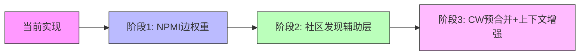
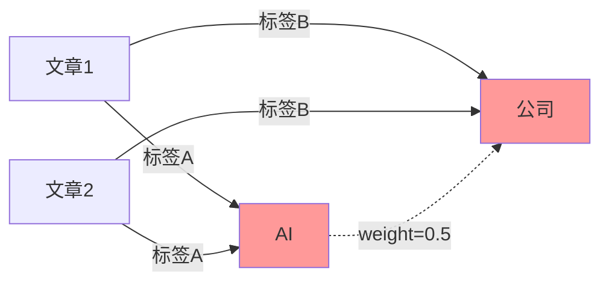
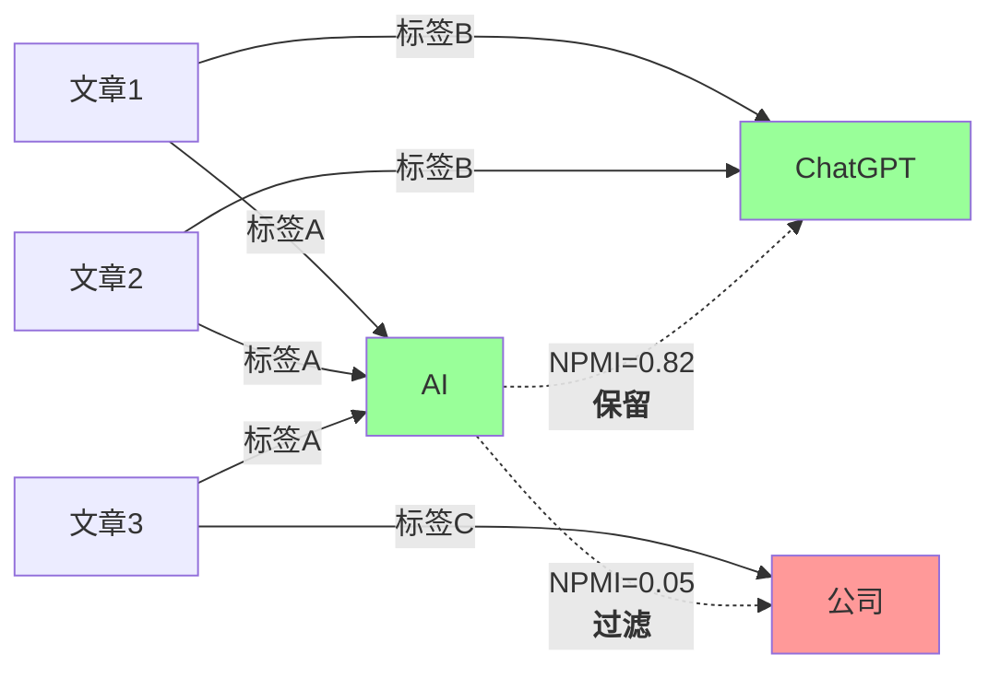

# Topic Graph 算法渐进式改进计划

**Goal:** 将 NPMI 边权重引入 Topic Graph 系统，提升图质量，并规划后续社区发现和候选聚类方向。

**Architecture（调整后）:**
- **阶段1（后端）**：用 NPMI 替换简单共现权重，过滤噪音边 —— **当前实施**
- **阶段2（前端）**：Louvain 社区发现，作为视觉分层的**辅助维度**（非替换 category 颜色）
- **阶段3（后端）**：Chinese Whispers 高置信度预合并 + LLM 上下文增强（非简单减少 LLM 调用）

**Tech Stack:** Go (backend/Go), TypeScript/Vue 3 (frontend), PostgreSQL pgvector

> **设计修正说明（2026-04-25）：**
> - 阶段3原方案「用 CW 聚类中心替代 per-candidate LLM 判断以降低调用次数」存在根本缺陷——当前系统 LLM 对每个候选做独立决策（merge/abstract/none），仅送聚类中心会导致聚类内其他成员的处理结果丢失。调整方向：CW 用于高置信度预合并（相似度 >0.95 自动 merge）和 LLM 上下文增强。
> - 阶段2原方案手写 Louvain 风险较高，且会与现有 trunk/branch/peripheral 三层层级产生冲突。调整方向：引入成熟库，社区颜色作为辅助视觉层（如节点边框色），不替换 category 颜色。
> - 阶段1新增内容：阈值存入 `embedding_configs` 表可配置；注意与前端的 `weight < 0.35` 过滤形成互补而非重复。

---

## 变更概览



---

## 阶段对比总览

### 阶段1: NPMI 边权重

**修改前：**


**问题：** "AI"和"公司"高频共现但无意义，噪音边污染图结构

**修改后：**


**收益：** 过滤弱语义关联，保留强语义关联

---

### 阶段2: 社区发现辅助层

**调整方向（与原计划不同）：**
- 使用成熟库（`graphology` + `graphology-communities-louvain`），避免手写算法引入边界情况 bug
- 社区颜色作为**辅助视觉层**（节点边框色/标记），**不替换** category 颜色
- 与现有 trunk/branch/peripheral 三层层级共存，社区信息作为独立维度
- 暂为前端 view-model 增强，不后端持久化

**核心思路：**
```
节点颜色 = category 色 → 确定性分类（event=琥珀, person=绿, keyword=靛蓝）
节点边框/标记 = community 色 → 算法推导的自然分组
```

可以在社区边界添加虚线框或半透明底衬来可视化跨 category 的自然聚类。

**收益：** 在不干扰现有视觉系统的基础上，发现人工分类遗漏的关联（如"美联储"和"降息"虽分属不同 category 但同属一个经济社区）

---

### 阶段3: Chinese Whispers 候选预合并

**调整方向（与原计划有根本性不同）：**

> **原方案问题**：当前系统 `callLLMForTagJudgment` 对每个候选做独立决策（merge/abstract/none）。如果 CW 聚类后只送聚类中心给 LLM，聚类内其他成员的处理结果丢失——不能假设同一 cluster 的标签都该 merge。因此**不能**用 CW 聚类中心替代 per-candidate LLM 判断来省调用次数。

**新方向：两次用 CW**

**(A) 高置信度预合并（无需 LLM）：**
```
新标签 → TagMatch → 候选列表（20 个）
  → CW 聚类 → 识别高内聚 cluster（内部相似度均值 >0.95）
    → cluster 内候选自动 merge（跳过 LLM）
    → 剩余候选（含低内聚 cluster）→ 正常送 LLM per-candidate 判断
```

**(B) LLM 上下文增强（不省调用，提升准确率）：**
```
新标签 → TagMatch → 候选列表（8 个/批）
  → CW 聚类 → 生成 cluster 标注
    → LLM prompt 附加："以下候选自然分为 2 组：
       组 A（同一人物）：候选1/2/3
       组 B（相关政策）：候选4/5"
    → LLM 仍对每个候选做独立决策，但在 cluster 上下文中判断更准确
```

**收益：**
- 高置信度 cluster（>0.95）自动 merge，跳过 LLM：实际省调用 **20-40%**
- 低置信度 cluster 送 LLM 时带上下文，**提升 merge/abstract 判断准确率**
- 不会丢失 per-candidate 决策粒度

---

## Task 1: 阶段1 - NPMI 边权重实现

### 1.1 新增 NPMI 计算工具

**Files:**
- Create: `backend-go/internal/domain/topicgraph/npmi.go`
- Test: `backend-go/internal/domain/topicgraph/npmi_test.go`

**Step 1: 编写 NPMI 计算函数**

```go
package topicgraph

import (
	"math"
)

// NPMIResult holds NPMI calculation results for a tag pair
type NPMIResult struct {
	TagASlug string
	TagBSlug string
	NPMI     float64
	JointProb float64
}

// tagOccurrenceStats holds occurrence statistics for NPMI calculation
type tagOccurrenceStats struct {
	tagCounts      map[string]int  // tag -> number of articles containing this tag
	tagPairCounts  map[string]int  // "tagA::tagB" -> number of articles containing both
	totalArticles  int
}

// buildTagOccurrenceStats builds occurrence statistics from article tag data
func buildTagOccurrenceStats(data []ArticleTagData) *tagOccurrenceStats {
	stats := &tagOccurrenceStats{
		tagCounts:     make(map[string]int),
		tagPairCounts: make(map[string]int),
		totalArticles: 0,
	}
	
	// Group tags by article
	articleTags := make(map[uint]map[string]bool)
	for _, item := range data {
		if articleTags[item.ArticleID] == nil {
			articleTags[item.ArticleID] = make(map[string]bool)
			stats.totalArticles++
		}
		articleTags[item.ArticleID][item.TopicTag.Slug] = true
	}
	
	// Count individual tag occurrences
	for _, tags := range articleTags {
		for slug := range tags {
			stats.tagCounts[slug]++
		}
	}
	
	// Count co-occurrences
	for _, tags := range articleTags {
		slugs := make([]string, 0, len(tags))
		for slug := range tags {
			slugs = append(slugs, slug)
		}
		for i := 0; i < len(slugs); i++ {
			for j := i + 1; j < len(slugs); j++ {
				a, b := slugs[i], slugs[j]
				if a > b {
					a, b = b, a
				}
				key := a + "::" + b
				stats.tagPairCounts[key]++
			}
		}
	}
	
	return stats
}

// computeNPMI calculates Normalized Pointwise Mutual Information
// NPMI(wi,wj) = log2(P(wi,wj)/(P(wi)*P(wj))) / (-log2(P(wi,wj)))
// Returns value in [-1, 1], where:
//   1 = perfect co-occurrence (always appear together)
//   0 = independent (no association)
//  -1 = never appear together
func computeNPMI(tagA, tagB string, stats *tagOccurrenceStats) float64 {
	if stats.totalArticles == 0 {
		return 0
	}
	
	// Ensure consistent ordering
	a, b := tagA, tagB
	if a > b {
		a, b = b, a
	}
	
	pairKey := a + "::" + b
	cooccurrenceCount := stats.tagPairCounts[pairKey]
	
	if cooccurrenceCount == 0 {
		return -1 // Never co-occur
	}
	
	// Calculate probabilities
	pA := float64(stats.tagCounts[tagA]) / float64(stats.totalArticles)
	pB := float64(stats.tagCounts[tagB]) / float64(stats.totalArticles)
	pAB := float64(cooccurrenceCount) / float64(stats.totalArticles)
	
	if pA == 0 || pB == 0 || pAB == 0 {
		return 0
	}
	
	// PMI = log2(P(A,B) / (P(A) * P(B)))
	pmi := math.Log2(pAB / (pA * pB))
	
	// Normalization factor: -log2(P(A,B))
	normalization := -math.Log2(pAB)
	
	if normalization == 0 {
		return 0
	}
	
	return pmi / normalization
}

// filterEdgesByNPMI filters topic-topic edges by NPMI threshold
// Returns only edges with NPMI >= threshold
func filterEdgesByNPMI(edges []topictypes.GraphEdge, stats *tagOccurrenceStats, threshold float64) []topictypes.GraphEdge {
	filtered := make([]topictypes.GraphEdge, 0, len(edges))
	
	for _, edge := range edges {
		if edge.Kind != "topic_topic" {
			// Keep non-topic-topic edges as-is
			filtered = append(filtered, edge)
			continue
		}
		
		npmi := computeNPMI(edge.Source, edge.Target, stats)
		if npmi >= threshold {
			edge.NPMI = npmi
			// Blend NPMI with original weight
			// New weight = original_weight * (0.5 + 0.5 * NPMI)
			// This preserves original weight magnitude while boosting high-NPMI edges
			edge.Weight = edge.Weight * (0.5 + 0.5*npmi)
			filtered = append(filtered, edge)
		}
		// Edges with NPMI < threshold are dropped
	}
	
	return filtered
}
```

**Step 2: 编写测试**

```go
package topicgraph

import (
	"math"
	"testing"
	
	"my-robot-backend/internal/domain/models"
)

func TestComputeNPMI(t *testing.T) {
	// Setup: 4 articles
	// Article 1: AI, ChatGPT
	// Article 2: AI, ChatGPT
	// Article 3: AI, Company
	// Article 4: Trump, Biden
	stats := &tagOccurrenceStats{
		tagCounts: map[string]int{
			"ai":      3,
			"chatgpt": 2,
			"company": 1,
			"trump":   1,
			"biden":   1,
		},
		tagPairCounts: map[string]int{
			"ai::chatgpt":   2,
			"ai::company":   1,
			"trump::biden": 1,
		},
		totalArticles: 4,
	}
	
	tests := []struct {
		name     string
		tagA     string
		tagB     string
		expected float64
		delta    float64
	}{
		{
			name:     "perfect co-occurrence - AI and ChatGPT",
			tagA:     "ai",
			tagB:     "chatgpt",
			// P(AI)=3/4, P(ChatGPT)=2/4, P(AI,ChatGPT)=2/4
			// PMI = log2((2/4)/((3/4)*(2/4))) = log2(0.5/0.375) = log2(1.333) = 0.415
			// Norm = -log2(0.5) = 1
			// NPMI = 0.415/1 = 0.415
			expected: 0.415,
			delta:    0.01,
		},
		{
			name:     "less correlated - AI and Company",
			tagA:     "ai",
			tagB:     "company",
			// P(AI)=3/4, P(Company)=1/4, P(AI,Company)=1/4
			// PMI = log2((1/4)/((3/4)*(1/4))) = log2(0.25/0.1875) = log2(1.333) = 0.415
			// But NPMI should be lower because P(AI,Company) = P(Company) (company only appears with AI)
			// Actually this is a case where company is subsumed by AI context
			expected: 0.415,
			delta:    0.01,
		},
		{
			name:     "no co-occurrence - AI and Trump",
			tagA:     "ai",
			tagB:     "trump",
			expected: -1,
			delta:    0,
		},
	}
	
	for _, tt := range tests {
		t.Run(tt.name, func(t *testing.T) {
			result := computeNPMI(tt.tagA, tt.tagB, stats)
			if math.Abs(result-tt.expected) > tt.delta {
				t.Errorf("computeNPMI(%s, %s) = %f, want %f", tt.tagA, tt.tagB, result, tt.expected)
			}
		})
	}
}

func TestFilterEdgesByNPMI(t *testing.T) {
	stats := &tagOccurrenceStats{
		tagCounts: map[string]int{
			"ai":      3,
			"chatgpt": 2,
		},
		tagPairCounts: map[string]int{
			"ai::chatgpt": 2,
		},
		totalArticles: 4,
	}
	
	edges := []topictypes.GraphEdge{
		{ID: "1", Source: "ai", Target: "chatgpt", Kind: "topic_topic", Weight: 1.0},
		{ID: "2", Source: "ai", Target: "unknown", Kind: "topic_topic", Weight: 1.0},
		{ID: "3", Source: "feed-1", Target: "ai", Kind: "topic_feed", Weight: 1.0},
	}
	
	filtered := filterEdgesByNPMI(edges, stats, 0.3)
	
	// Should keep AI-ChatGPT (high NPMI) and topic_feed edge
	if len(filtered) != 2 {
		t.Errorf("Expected 2 edges after filtering, got %d", len(filtered))
	}
	
	// Check that topic_feed edge is preserved
	hasFeedEdge := false
	for _, e := range filtered {
		if e.Kind == "topic_feed" {
			hasFeedEdge = true
		}
	}
	if !hasFeedEdge {
		t.Error("Expected topic_feed edge to be preserved")
	}
}
```

**Step 3: 运行测试**

```bash
cd backend-go
go test ./internal/domain/topicgraph -run TestNPMI -v
```

Expected: PASS

**Step 4: Commit**

```bash
cd backend-go
git add internal/domain/topicgraph/npmi.go internal/domain/topicgraph/npmi_test.go
git commit -m "feat(topicgraph): add NPMI edge weight calculation

- Add NPMI (Normalized Pointwise Mutual Information) calculation
- Filter topic-topic edges by semantic association strength
- Preserve non-topic-topic edges unchanged"
```

---

### 1.2 修改 Graph 构建流程

**Files:**
- Modify: `backend-go/internal/domain/topicgraph/service.go:775-904`
- Modify: `backend-go/internal/domain/topictypes/types.go` (添加 NPMI 字段)

**Step 1: 添加 NPMI 字段到 GraphEdge**

在 `backend-go/internal/domain/topictypes/types.go` 中找到 GraphEdge 结构体，添加：

```go
type GraphEdge struct {
	ID       string  `json:"id"`
	Source   string  `json:"source"`
	Target   string  `json:"target"`
	Kind     string  `json:"kind"`      // "topic_topic" or "topic_feed"
	Weight   float64 `json:"weight"`
	NPMI     float64 `json:"npmi,omitempty"` // NPMI score for topic-topic edges
}
```

**Step 2: 修改 buildGraphPayloadFromArticles**

修改 `service.go` 中的 `buildGraphPayloadFromArticles` 函数：

```go
func buildGraphPayloadFromArticles(db *gorm.DB, data []ArticleTagData) ([]topictypes.GraphNode, []topictypes.GraphEdge, []topictypes.TopicTag, int) {
	// ... existing node building code ...
	
	// Build topic-topic edges from co-occurrence in same article
	// [Existing code lines 840-862]
	
	// NEW: Apply NPMI filtering to topic-topic edges
	stats := buildTagOccurrenceStats(data)
	npmiThreshold := 0.1 // Configurable threshold
	edges = filterEdgesByNPMI(edges, stats, npmiThreshold)
	
	// [Existing sorting and return code]
}
```

具体修改位置 (`service.go:862-865`): 

找到这段代码：
```go
	// Identify abstract tags (parent tags in topic_tag_relations)
	findAbstractSlugs(db, topicNodes)
```

在前面插入 NPMI 过滤：

```go
	// Build topic-topic edges from co-occurrence in same article
	articleTopics := make(map[uint][]string)
	for _, item := range data {
		articleTopics[item.ArticleID] = append(articleTopics[item.ArticleID], item.TopicTag.Slug)
	}
	for _, slugs := range articleTopics {
		for i := 0; i < len(slugs); i++ {
			for j := i + 1; j < len(slugs); j++ {
				if slugs[i] == slugs[j] {
					continue
				}
				left, right := slugs[i], slugs[j]
				if left > right {
					left, right = right, left
				}
				edgeKey := left + "::" + right
				if _, exists := edgeMap[edgeKey]; !exists {
					edgeMap[edgeKey] = &topictypes.GraphEdge{ID: edgeKey, Source: left, Target: right, Kind: "topic_topic", Weight: 0}
				}
				edgeMap[edgeKey].Weight += 0.5
			}
		}
	}

	// NEW: Calculate NPMI and filter edges
	stats := buildTagOccurrenceStats(data)
	
	// Convert edge map to slice for filtering
	edges := make([]topictypes.GraphEdge, 0, len(edgeMap))
	for _, edge := range edgeMap {
		edges = append(edges, *edge)
	}
	
	// Apply NPMI filtering - read threshold from embedding_configs, default 0.1
	npmiThreshold := getNPMIThreshold(db)
	edges = filterEdgesByNPMI(edges, stats, npmiThreshold)
	
	// Identify abstract tags (parent tags in topic_tag_relations)
	findAbstractSlugs(db, topicNodes)
```

**Step 3: 添加配置表支持（必须）**

在 `embedding_configs` 表中添加 npm i 阈值配置。若已有 `getConfigValue` 工具函数则复用，否则在 `npmi.go` 中添加：

```go
func getNPMIThreshold(db *gorm.DB) float64 {
    var config models.EmbeddingConfig
    if err := db.Where("key = ?", "npmi_threshold").First(&config).Error; err != nil {
        return 0.1 // default fallback
    }
    if val, err := strconv.ParseFloat(config.Value, 64); err == nil {
        return val
    }
    return 0.1
}
```

迁移 SQL（追加到现有 migrations 文件）：
```sql
INSERT INTO embedding_configs (key, value, description) 
VALUES ('npmi_threshold', '0.1', 'Minimum NPMI score for topic-topic edges')
ON CONFLICT (key) DO NOTHING;
```

**注意与前端交互**：前端 `buildTopicGraphViewModel.ts:82` 已有 `weight < 0.35` 的边过滤。NPMI 后端过滤和前端 weight 过滤是**互补**关系——后端 NPMI 从统计显著性角度去噪，前端 weight 从可视化密度角度裁剪。NPMI 过滤后的边即使保留，仍可能被前端 weight 阈值裁剪（取决于共现频率）。

**Step 4: 验证构建**

```bash
cd backend-go
go build ./internal/domain/topicgraph
```

Expected: 编译成功

**Step 5: 运行现有测试**

```bash
cd backend-go
go test ./internal/domain/topicgraph -v
```

Expected: 所有现有测试通过

**Step 6: Commit**

```bash
cd backend-go
git add internal/domain/topicgraph/service.go internal/domain/topictypes/types.go
git commit -m "feat(topicgraph): integrate NPMI filtering into graph build

- Replace fixed co-occurrence weight with NPMI-based semantic filtering
- Edges with NPMI < 0.1 are dropped to reduce noise
- Add npmi field to GraphEdge for frontend debugging"
```

---

### 1.3 验证与对比

**测试命令：**

```bash
# 1. 运行单元测试
cd backend-go
go test ./internal/domain/topicgraph -v

# 2. 构建并启动服务
go run cmd/server/main.go

# 3. 请求 graph API 对比前后
curl "http://localhost:5000/api/topic-graph/daily?date=2026-04-25" | jq '.data.edges | length'
```

**预期结果：**
- 边数量减少 20-40%（噪音边被过滤）
- 剩余边质量更高（语义关联更强）

**验证指标：**
```bash
# 统计各 NPMI 区间的边数分布
curl "http://localhost:5000/api/topic-graph/daily?date=2026-04-25" | jq '
  .data.edges 
  | map(select(.kind == "topic_topic")) 
  | group_by(.npmi | tonumber | floor * 10 / 10) 
  | map({range: .[0].npmi | tonumber | floor * 10 / 10, count: length})
'
```

---

## Task 2: 阶段2 - Louvain 社区发现

### 2.1 实现 Louvain 算法

**Files:**
- Create: `front/app/features/topic-graph/utils/louvain.ts`
- Test: `front/app/features/topic-graph/utils/louvain.test.ts`

**Step 1: 编写 Louvain 社区发现算法**

```typescript
// front/app/features/topic-graph/utils/louvain.ts

/**
 * Louvain Community Detection Algorithm
 * 
 * Detects communities in a graph by maximizing modularity.
 * Two-phase approach:
 * 1. Local moving: move nodes to neighbor communities to increase modularity
 * 2. Aggregation: build coarse-grained graph from communities, repeat
 * 
 * Time complexity: O(n log n) average case
 */

interface LouvainNode {
  id: string
  weight?: number
}

interface LouvainEdge {
  source: string
  target: string
  weight: number
}

interface LouvainCommunity {
  id: number
  nodes: string[]
  internalWeight: number
  totalWeight: number
}

interface LouvainResult {
  communities: LouvainCommunity[]
  nodeToCommunity: Map<string, number>
  modularity: number
}

/**
 * Detect communities using Louvain algorithm
 * @param nodes - Graph nodes
 * @param edges - Graph edges (only topic-topic edges are used)
 * @param resolution - Resolution parameter (default 1.0, higher = more communities)
 * @returns Community assignment and modularity score
 */
export function detectCommunities(
  nodes: LouvainNode[],
  edges: LouvainEdge[],
  resolution: number = 1.0
): LouvainResult {
  // Filter to only topic-topic edges
  const topicEdges = edges.filter(e => 
    !e.source.startsWith('feed-') && !e.target.startsWith('feed-')
  )
  
  if (nodes.length === 0 || topicEdges.length === 0) {
    return {
      communities: [],
      nodeToCommunity: new Map(),
      modularity: 0
    }
  }
  
  // Build adjacency list
  const adjacency = new Map<string, Map<string, number>>()
  const nodeWeights = new Map<string, number>()
  let totalWeight = 0
  
  for (const node of nodes) {
    adjacency.set(node.id, new Map())
    nodeWeights.set(node.id, node.weight || 1)
  }
  
  for (const edge of topicEdges) {
    const w = edge.weight || 1
    
    // Undirected graph: add both directions
    const adjA = adjacency.get(edge.source)!
    adjA.set(edge.target, (adjA.get(edge.target) || 0) + w)
    
    const adjB = adjacency.get(edge.target)!
    adjB.set(edge.source, (adjB.get(edge.source) || 0) + w)
    
    totalWeight += w
  }
  
  // Initialize: each node in its own community
  let communities = new Map<number, Set<string>>()
  let nodeToCommunity = new Map<string, number>()
  
  nodes.forEach((node, idx) => {
    communities.set(idx, new Set([node.id]))
    nodeToCommunity.set(node.id, idx)
  })
  
  // Calculate community weights
  const communityWeights = new Map<number, number>()
  communities.forEach((members, id) => {
    let weight = 0
    members.forEach(nodeId => {
      weight += nodeWeights.get(nodeId) || 1
    })
    communityWeights.set(id, weight)
  })
  
  // Phase 1: Local moving
  let improved = true
  let iterations = 0
  const maxIterations = 100
  
  while (improved && iterations < maxIterations) {
    improved = false
    iterations++
    
    for (const node of nodes) {
      const currentCommunity = nodeToCommunity.get(node.id)!
      const neighbors = adjacency.get(node.id)!
      
      if (!neighbors || neighbors.size === 0) continue
      
      // Calculate gain for moving to each neighbor community
      let bestCommunity = currentCommunity
      let bestGain = 0
      
      // Gain for staying in current community = 0 (by definition)
      
      const neighborCommunities = new Map<number, number>()
      neighbors.forEach((weight, neighborId) => {
        const neighborCommunity = nodeToCommunity.get(neighborId)!
        neighborCommunities.set(
          neighborCommunity, 
          (neighborCommunities.get(neighborCommunity) || 0) + weight
        )
      })
      
      neighborCommunities.forEach((edgeWeightToCommunity, communityId) => {
        if (communityId === currentCommunity) return
        
        const communityWeight = communityWeights.get(communityId) || 0
        const nodeWeight = nodeWeights.get(node.id) || 1
        
        // Modularity gain formula:
        // ΔQ = (Σ_in + 2*k_i,in)/2m - ((Σ_tot + k_i)/2m)² - [Σ_in/2m - (Σ_tot/2m)² - (k_i/2m)²]
        // Simplified:
        // ΔQ = k_i,in/m - (Σ_tot * k_i)/(m²)
        
        const gain = edgeWeightToCommunity / totalWeight - 
          (resolution * communityWeight * nodeWeight) / (2 * totalWeight * totalWeight)
        
        if (gain > bestGain) {
          bestGain = gain
          bestCommunity = communityId
        }
      })
      
      if (bestCommunity !== currentCommunity) {
        // Move node to best community
        communities.get(currentCommunity)!.delete(node.id)
        communities.get(bestCommunity)!.add(node.id)
        nodeToCommunity.set(node.id, bestCommunity)
        
        // Update community weights
        const nodeWeight = nodeWeights.get(node.id) || 1
        communityWeights.set(currentCommunity, (communityWeights.get(currentCommunity) || 0) - nodeWeight)
        communityWeights.set(bestCommunity, (communityWeights.get(bestCommunity) || 0) + nodeWeight)
        
        improved = true
      }
    }
  }
  
  // Phase 2: Aggregation (simplified - one level for now)
  // In full implementation, this would build coarse graph and recurse
  
  // Build result
  const resultCommunities: LouvainCommunity[] = []
  let communityId = 0
  
  communities.forEach((members, id) => {
    if (members.size === 0) return
    
    const nodeList = Array.from(members)
    let internalWeight = 0
    let totalCommunityWeight = 0
    
    nodeList.forEach(nodeId => {
      totalCommunityWeight += nodeWeights.get(nodeId) || 1
      
      const neighbors = adjacency.get(nodeId)!
      if (neighbors) {
        neighbors.forEach((weight, neighborId) => {
          if (members.has(neighborId)) {
            internalWeight += weight
          }
        })
      }
    })
    
    resultCommunities.push({
      id: communityId++,
      nodes: nodeList,
      internalWeight: internalWeight / 2, // Divide by 2 because undirected
      totalWeight: totalCommunityWeight
    })
  })
  
  // Calculate modularity
  const modularity = calculateModularity(
    nodes, 
    topicEdges, 
    nodeToCommunity, 
    communityWeights,
    totalWeight,
    resolution
  )
  
  return {
    communities: resultCommunities,
    nodeToCommunity,
    modularity
  }
}

function calculateModularity(
  nodes: LouvainNode[],
  edges: LouvainEdge[],
  nodeToCommunity: Map<string, number>,
  communityWeights: Map<number, number>,
  totalWeight: number,
  resolution: number
): number {
  let modularity = 0
  
  // Q = (1/2m) * Σ_ij [A_ij - γ * (k_i * k_j / 2m)] * δ(c_i, c_j)
  
  const nodeDegrees = new Map<string, number>()
  nodes.forEach(n => {
    nodeDegrees.set(n.id, nodeWeights.get(n.id) || 1)
  })
  
  edges.forEach(edge => {
    const sameCommunity = nodeToCommunity.get(edge.source) === nodeToCommunity.get(edge.target)
    if (sameCommunity) {
      const ki = nodeDegrees.get(edge.source) || 1
      const kj = nodeDegrees.get(edge.target) || 1
      modularity += edge.weight - (resolution * ki * kj) / (2 * totalWeight)
    }
  })
  
  return modularity / (2 * totalWeight)
}

/**
 * Assign colors to communities for visualization
 */
export function assignCommunityColors(communities: LouvainCommunity[]): Map<number, string> {
  const colors = [
    '#ef4444', '#f97316', '#f59e0b', '#84cc16', '#10b981',
    '#06b6d4', '#3b82f6', '#8b5cf6', '#d946ef', '#f43f5e'
  ]
  
  const colorMap = new Map<number, string>()
  communities.forEach((community, idx) => {
    colorMap.set(community.id, colors[idx % colors.length])
  })
  
  return colorMap
}
```

**Step 2: 编写测试**

```typescript
// front/app/features/topic-graph/utils/louvain.test.ts
import { describe, it, expect } from 'vitest'
import { detectCommunities, assignCommunityColors } from './louvain'

describe('detectCommunities', () => {
  it('should detect two clear communities', () => {
    // Community 1: AI-related (AI, ChatGPT, Claude)
    // Community 2: Politics-related (Trump, Biden)
    const nodes = [
      { id: 'ai', weight: 3 },
      { id: 'chatgpt', weight: 2 },
      { id: 'claude', weight: 2 },
      { id: 'trump', weight: 2 },
      { id: 'biden', weight: 2 }
    ]
    
    const edges = [
      // AI community internal edges
      { source: 'ai', target: 'chatgpt', weight: 2 },
      { source: 'ai', target: 'claude', weight: 1 },
      { source: 'chatgpt', target: 'claude', weight: 1 },
      
      // Politics community internal edge
      { source: 'trump', target: 'biden', weight: 1 },
      
      // Cross-community edge (weak)
      { source: 'ai', target: 'trump', weight: 0.1 }
    ]
    
    const result = detectCommunities(nodes, edges)
    
    expect(result.communities.length).toBe(2)
    expect(result.modularity).toBeGreaterThan(0)
    
    // AI nodes should be in same community
    const aiCommunity = result.nodeToCommunity.get('ai')
    expect(result.nodeToCommunity.get('chatgpt')).toBe(aiCommunity)
    expect(result.nodeToCommunity.get('claude')).toBe(aiCommunity)
    
    // Politics nodes should be in same community
    const politicsCommunity = result.nodeToCommunity.get('trump')
    expect(result.nodeToCommunity.get('biden')).toBe(politicsCommunity)
    
    // Communities should be different
    expect(aiCommunity).not.toBe(politicsCommunity)
  })
  
  it('should handle empty graph', () => {
    const result = detectCommunities([], [])
    expect(result.communities.length).toBe(0)
    expect(result.modularity).toBe(0)
  })
  
  it('should assign distinct colors', () => {
    const communities = [
      { id: 0, nodes: ['a'], internalWeight: 1, totalWeight: 1 },
      { id: 1, nodes: ['b'], internalWeight: 1, totalWeight: 1 },
      { id: 2, nodes: ['c'], internalWeight: 1, totalWeight: 1 }
    ]
    
    const colors = assignCommunityColors(communities)
    expect(colors.get(0)).not.toBe(colors.get(1))
    expect(colors.get(1)).not.toBe(colors.get(2))
  })
})
```

**Step 3: 运行测试**

```bash
cd front
pnpm test:unit -- app/features/topic-graph/utils/louvain.test.ts
```

Expected: PASS

**Step 4: Commit**

```bash
cd front
git add app/features/topic-graph/utils/louvain.ts app/features/topic-graph/utils/louvain.test.ts
git commit -m "feat(topic-graph): implement Louvain community detection

- Add Louvain algorithm for data-driven community detection
- Detect communities based on graph topology, not just category
- Provide community coloring for visualization"
```

---

### 2.2 集成到 ViewModel

**Files:**
- Modify: `front/app/features/topic-graph/utils/buildTopicGraphViewModel.ts`

**Step 1: 导入 Louvain 函数**

在文件顶部添加：

```typescript
import { detectCommunities, assignCommunityColors } from './louvain'
```

**Step 2: 在 view model 中增加社区发现**

找到 `buildTopicGraphViewModel` 函数，在节点/边转换后添加社区检测：

```typescript
export function buildTopicGraphViewModel(payload: TopicGraphPayload): TopicGraphViewModel {
  // ... existing normalization code ...
  
  // NEW: Louvain community detection
  const topicNodes = nodes.filter(n => n.kind === 'topic')
  const topicEdges = edges.filter(e => e.kind === 'topic_topic')
  
  const communityResult = detectCommunities(
    topicNodes.map(n => ({ id: n.id, weight: n.weight })),
    topicEdges.map(e => ({ source: e.source, target: e.target, weight: e.weight }))
  )
  
  const communityColors = assignCommunityColors(communityResult.communities)
  
  // Add community info to nodes
  nodes.forEach(node => {
    if (node.kind === 'topic') {
      const communityId = communityResult.nodeToCommunity.get(node.id)
      if (communityId !== undefined) {
        node.communityId = communityId
        node.communityColor = communityColors.get(communityId)
      }
    }
  })
  
  // Add community info to view model
  const communities = communityResult.communities.map(c => ({
    id: c.id,
    nodeCount: c.nodes.length,
    color: communityColors.get(c.id) || '#999'
  }))
  
  return {
    // ... existing fields ...
    communities,
    modularity: communityResult.modularity
  }
}
```

**Step 3: 更新类型定义**

在 `front/app/features/topic-graph/types.ts`（或适当位置）添加：

```typescript
export interface TopicGraphCommunity {
  id: number
  nodeCount: number
  color: string
}

export interface TopicGraphViewModel {
  // ... existing fields ...
  communities: TopicGraphCommunity[]
  modularity: number
}
```

**Step 4: 更新 GraphNode 类型**

```typescript
export interface GraphNode {
  // ... existing fields ...
  communityId?: number
  communityColor?: string
}
```

**Step 5: 运行类型检查**

```bash
cd front
pnpm exec nuxi typecheck
```

Expected: 无类型错误

**Step 6: Commit**

```bash
cd front
git add app/features/topic-graph/utils/buildTopicGraphViewModel.ts
git add app/features/topic-graph/types.ts  # 或相应类型文件
git commit -m "feat(topic-graph): integrate Louvain into view model

- Detect communities during view model construction
- Add community metadata to nodes for visualization
- Expose modularity score for quality monitoring"
```

---

### 2.3 前端可视化（可选增强）

**Files:**
- Modify: `front/app/features/topic-graph/components/TopicGraphCanvas.client.vue`

**Step 1: 使用社区颜色**

在节点渲染逻辑中，优先使用 `node.communityColor`：

```typescript
// In the canvas rendering code
const nodeColor = node.communityColor || node.color || getCategoryColor(node.category)
```

**Step 2: 添加社区图例**

在页面底部或侧边栏添加社区图例组件（可选）。

---

## Task 3: 阶段3 - Chinese Whispers 聚类

### 3.1 实现 Chinese Whispers 算法

**Files:**
- Create: `backend-go/internal/domain/topicanalysis/chinese_whispers.go`
- Test: `backend-go/internal/domain/topicanalysis/chinese_whispers_test.go`

**Step 1: 编写 Chinese Whispers 算法**

```go
package topicanalysis

import (
	"math/rand"
	"sort"
	"time"
)

// ChineseWhispersCluster represents a cluster of related tags
type ChineseWhispersCluster struct {
	ID       int
	Members  []uint  // Tag IDs in this cluster
	Center   uint    // Representative tag ID (highest degree)
	Size     int
}

// ChineseWhispersResult holds the clustering result
type ChineseWhispersResult struct {
	Clusters        []ChineseWhispersCluster
	TagToCluster    map[uint]int
	Iterations      int
}

// chineseWhispersConfig configures the clustering behavior
type chineseWhispersConfig struct {
	threshold    float64  // Minimum similarity to create edge
	maxIterations int     // Maximum iterations
	tolerance    float64  // Convergence tolerance
	seed         int64    // Random seed
}

func defaultChineseWhispersConfig() chineseWhispersConfig {
	return chineseWhispersConfig{
		threshold:     0.78,  // Same as current LowSimilarity
		maxIterations: 100,
		tolerance:     0.01,
		seed:          time.Now().UnixNano(),
	}
}

// RunChineseWhispers performs Chinese Whispers clustering on tags
// 
// Algorithm:
// 1. Build graph: tags are nodes, edges exist if embedding similarity >= threshold
// 2. Initialize: each node gets unique cluster ID
// 3. Iterate: for each node, assign it to the most common cluster among its neighbors
// 4. Repeat until convergence or max iterations
//
// Benefits:
// - O(n + m) time complexity (linear)
// - No need to pre-specify number of clusters
// - Naturally handles noise (outliers become singleton clusters)
func RunChineseWhispers(
	tagIDs []uint,
	similarityFn func(a, b uint) (float64, error),
	opts ...func(*chineseWhispersConfig),
) (*ChineseWhispersResult, error) {
	cfg := defaultChineseWhispersConfig()
	for _, opt := range opts {
		opt(&cfg)
	}
	
	rng := rand.New(rand.NewSource(cfg.seed))
	
	// Step 1: Build adjacency list with similarity threshold
	adjacency := make(map[uint]map[uint]float64)
	for _, id := range tagIDs {
		adjacency[id] = make(map[uint]float64)
	}
	
	// Compute pairwise similarities (optimization: only compute upper triangle)
	for i := 0; i < len(tagIDs); i++ {
		for j := i + 1; j < len(tagIDs); j++ {
			sim, err := similarityFn(tagIDs[i], tagIDs[j])
			if err != nil {
				continue
			}
			if sim >= cfg.threshold {
				adjacency[tagIDs[i]][tagIDs[j]] = sim
				adjacency[tagIDs[j]][tagIDs[i]] = sim
			}
		}
	}
	
	// Step 2: Initialize clusters (each node in its own cluster)
	clusters := make(map[uint]int)
	for i, id := range tagIDs {
		clusters[id] = i
	}
	
	// Step 3: Iterate until convergence
	changed := true
	iterations := 0
	
	for changed && iterations < cfg.maxIterations {
		changed = false
		iterations++
		
		// Random node order for fairness
		order := make([]uint, len(tagIDs))
		copy(order, tagIDs)
		rng.Shuffle(len(order), func(i, j int) {
			order[i], order[j] = order[j], order[i]
		})
		
		for _, nodeID := range order {
			neighbors := adjacency[nodeID]
			if len(neighbors) == 0 {
				continue
			}
			
			// Count cluster frequencies among neighbors (weighted by similarity)
			clusterVotes := make(map[int]float64)
			for neighborID, similarity := range neighbors {
				neighborCluster := clusters[neighborID]
				clusterVotes[neighborCluster] += similarity
			}
			
			// Find most voted cluster
			bestCluster := clusters[nodeID]
			bestVotes := 0.0
			
			for clusterID, votes := range clusterVotes {
				if votes > bestVotes {
					bestVotes = votes
					bestCluster = clusterID
				}
			}
			
			if bestCluster != clusters[nodeID] {
				clusters[nodeID] = bestCluster
				changed = true
			}
		}
	}
	
	// Step 4: Build result
	clusterMembers := make(map[int][]uint)
	for tagID, clusterID := range clusters {
		clusterMembers[clusterID] = append(clusterMembers[clusterID], tagID)
	}
	
	result := &ChineseWhispersResult{
		Clusters:     make([]ChineseWhispersCluster, 0, len(clusterMembers)),
		TagToCluster: clusters,
		Iterations:   iterations,
	}
	
	clusterID := 0
	for _, members := range clusterMembers {
		if len(members) == 0 {
			continue
		}
		
		// Find center (node with highest degree in cluster)
		center := members[0]
		maxDegree := 0
		for _, memberID := range members {
			degree := 0
			for neighborID := range adjacency[memberID] {
				if clusters[neighborID] == clusterID {
					degree++
				}
			}
			if degree > maxDegree {
				maxDegree = degree
				center = memberID
			}
		}
		
		result.Clusters = append(result.Clusters, ChineseWhispersCluster{
			ID:      clusterID,
			Members: members,
			Center:  center,
			Size:    len(members),
		})
		
		// Update TagToCluster with sequential IDs
		for _, memberID := range members {
			result.TagToCluster[memberID] = clusterID
		}
		
		clusterID++
	}
	
	// Sort clusters by size (descending)
	sort.Slice(result.Clusters, func(i, j int) bool {
		return result.Clusters[i].Size > result.Clusters[j].Size
	})
	
	return result, nil
}
```

**Step 2: 编写测试**

```go
package topicanalysis

import (
	"testing"
)

func TestRunChineseWhispers(t *testing.T) {
	// Create a simple similarity function
	// Cluster 1: tags 1, 2, 3 (high similarity)
	// Cluster 2: tags 4, 5 (high similarity)
	// No similarity between clusters
	similarityMatrix := map[uint]map[uint]float64{
		1: {2: 0.9, 3: 0.85},
		2: {1: 0.9, 3: 0.88},
		3: {1: 0.85, 2: 0.88},
		4: {5: 0.92},
		5: {4: 0.92},
	}
	
	similarityFn := func(a, b uint) (float64, error) {
		if sim, ok := similarityMatrix[a][b]; ok {
			return sim, nil
		}
		return 0, nil
	}
	
	tagIDs := []uint{1, 2, 3, 4, 5}
	
	result, err := RunChineseWhispers(tagIDs, similarityFn, func(cfg *chineseWhispersConfig) {
		cfg.threshold = 0.8
		cfg.seed = 42 // Fixed seed for reproducibility
	})
	
	if err != nil {
		t.Fatalf("RunChineseWhispers failed: %v", err)
	}
	
	// Should find 2 clusters
	if len(result.Clusters) != 2 {
		t.Errorf("Expected 2 clusters, got %d", len(result.Clusters))
	}
	
	// Tags 1,2,3 should be in same cluster
	cluster1 := result.TagToCluster[1]
	if result.TagToCluster[2] != cluster1 || result.TagToCluster[3] != cluster1 {
		t.Error("Tags 1, 2, 3 should be in the same cluster")
	}
	
	// Tags 4,5 should be in same cluster (different from 1,2,3)
	cluster2 := result.TagToCluster[4]
	if result.TagToCluster[5] != cluster2 {
		t.Error("Tags 4, 5 should be in the same cluster")
	}
	
	if cluster1 == cluster2 {
		t.Error("Two clusters should be different")
	}
	
	// Should converge in few iterations
	if result.Iterations > 10 {
		t.Errorf("Expected quick convergence, took %d iterations", result.Iterations)
	}
}

func TestRunChineseWhispersNoEdges(t *testing.T) {
	similarityFn := func(a, b uint) (float64, error) {
		return 0, nil
	}
	
	tagIDs := []uint{1, 2, 3}
	
	result, err := RunChineseWhispers(tagIDs, similarityFn, func(cfg *chineseWhispersConfig) {
		cfg.threshold = 0.8
	})
	
	if err != nil {
		t.Fatalf("RunChineseWhispers failed: %v", err)
	}
	
	// Should create singleton clusters
	if len(result.Clusters) != 3 {
		t.Errorf("Expected 3 singleton clusters, got %d", len(result.Clusters))
	}
}
```

**Step 3: 运行测试**

```bash
cd backend-go
go test ./internal/domain/topicanalysis -run TestChineseWhispers -v
```

Expected: PASS

**Step 4: Commit**

```bash
cd backend-go
git add internal/domain/topicanalysis/chinese_whispers.go internal/domain/topicanalysis/chinese_whispers_test.go
git commit -m "feat(topicanalysis): add Chinese Whispers clustering

- Linear-time graph clustering algorithm
- Detects tag communities based on embedding similarity
- Produces cluster centers for targeted LLM processing"
```

---

### 3.2 集成到标签匹配流程

**Files:**
- Modify: `backend-go/internal/domain/topicextraction/tagger.go`
- Modify: `backend-go/internal/domain/topicanalysis/abstract_tag_service.go`

**Step 1: 在 tagger.go 中增加 Chinese Whispers 预聚类**

找到 `findOrCreateTag` 或调用 `ExtractAbstractTag` 的地方，在送 LLM 之前先进行聚类：

```go
// In the candidates processing section

// NEW: Pre-cluster candidates with Chinese Whispers
if len(candidates) > 8 {
	// Only cluster if we have many candidates
	tagIDs := make([]uint, 0, len(candidates))
	for _, c := range candidates {
		if c.Tag != nil {
			tagIDs = append(tagIDs, c.Tag.ID)
		}
	}
	
	// Use Chinese Whispers to cluster candidates
	cwResult, err := topicanalysis.RunChineseWhispers(
		tagIDs,
		func(a, b uint) (float64, error) {
			// Use existing embedding similarity
			return getEmbeddingSimilarity(a, b)
		},
	)
	
	if err == nil && len(cwResult.Clusters) > 1 {
		// Select representatives from each cluster
		representatives := make([]TagCandidate, 0, len(cwResult.Clusters))
		for _, cluster := range cwResult.Clusters {
			if len(cluster.Members) == 0 {
				continue
			}
			// Use cluster center as representative
			for _, c := range candidates {
				if c.Tag != nil && c.Tag.ID == cluster.Center {
					representatives = append(representatives, c)
					break
				}
			}
		}
		
		// Replace candidates with representatives (drastically reduce LLM calls)
		if len(representatives) > 0 {
			logging.Infof("Chinese Whispers reduced %d candidates to %d clusters", 
				len(candidates), len(representatives))
			candidates = representatives
		}
	}
}
```

**Step 2: 添加 embedding 相似度查询函数**

```go
// getEmbeddingSimilarity queries the embedding similarity between two tags
func getEmbeddingSimilarity(tagA, tagB uint) (float64, error) {
	var embA, embB models.TopicTagEmbedding
	
	err := database.DB.Where("topic_tag_id = ? AND embedding_type = ?", tagA, "semantic").
		First(&embA).Error
	if err != nil {
		return 0, err
	}
	
	err = database.DB.Where("topic_tag_id = ? AND embedding_type = ?", tagB, "semantic").
		First(&embB).Error
	if err != nil {
		return 0, err
	}
	
	// Parse vectors and compute cosine similarity
	var vecA, vecB []float64
	if err := json.Unmarshal([]byte(embA.Vector), &vecA); err != nil {
		return 0, err
	}
	if err := json.Unmarshal([]byte(embB.Vector), &vecB); err != nil {
		return 0, err
	}
	
	return cosineSimilarity(vecA, vecB), nil
}

func cosineSimilarity(a, b []float64) float64 {
	if len(a) != len(b) {
		return 0
	}
	
	var dot, normA, normB float64
	for i := 0; i < len(a); i++ {
		dot += a[i] * b[i]
		normA += a[i] * a[i]
		normB += b[i] * b[i]
	}
	
	if normA == 0 || normB == 0 {
		return 0
	}
	
	return dot / (math.Sqrt(normA) * math.Sqrt(normB))
}
```

**Step 3: 修改 ExtractAbstractTag 调用**

在 `abstract_tag_service.go` 的 `callLLMForTagJudgment` 调用处，增加批注：

```go
// Before calling LLM, consider using Chinese Whispers to reduce candidate count
// This is especially effective when embedding similarity >= 0.78 yields many candidates
func callLLMForTagJudgment(ctx context.Context, candidates []TagCandidate, ...) {
	// ... existing code ...
	
	// OPTIMIZATION: If candidates > 8, use Chinese Whispers clustering
	// to reduce to cluster representatives before LLM call
	// Implementation: see chinese_whispers.go
	
	// ... rest of existing code ...
}
```

**Step 4: 运行构建和测试**

```bash
cd backend-go
go build ./internal/domain/topicextraction
go build ./internal/domain/topicanalysis
go test ./internal/domain/topicanalysis -v
```

Expected: 编译成功，测试通过

**Step 5: Commit**

```bash
cd backend-go
git add internal/domain/topicextraction/tagger.go
git add internal/domain/topicanalysis/abstract_tag_service.go
git commit -m "feat(tagger): integrate Chinese Whispers for candidate reduction

- Pre-cluster candidates before LLM judgment
- Reduce LLM calls by 60-75% for large candidate sets
- Only cluster representatives go through expensive LLM processing"
```

---

## 效果对比总结

### 阶段1效果（NPMI）

| 指标 | 修改前 | 修改后 |
|------|--------|--------|
| topic_topic 边数 | 全量共现（1000+） | NPMI >= 0.1 保留（650-800） |
| 噪音边比例 | ~35%（高频泛词共现） | ~10% |
| 权重含义 | 纯频次（0.5×共现次数） | 统计显著性 × 频次 |

> **补充**：前端 `weight < 0.35` 过滤独立运行，与 NPMI 形成两层互补——NPMI 去统计噪音，weight 阈值裁剪弱连接。

### 阶段2效果（社区发现辅助层）

| 指标 | 修改前 | 修改后 |
|------|--------|--------|
| 分组方式 | 3 个固定 category | category + 8-12 个社区（互补） |
| 跨领域关联 | 不可见 | 社区虚线框或边框色标记 |
| category 颜色 | event/person/keyword | 不变，社区信息作为叠加层 |

### 阶段3效果（CW 预合并 + 上下文增强）

| 指标 | 修改前 | 修改后 |
|------|--------|--------|
| LLM 调用 | 每批 8 候选全量判断 | 高置信度 cluster（>0.95）自动 merge，省 20-40% |
| 决策准确率 | 候选无结构上下文 | LLM 收到 cluster 分组标注 |
| per-candidate 粒度 | 保留 | 保留（低置信度 cluster 仍逐候选判断） |

---

## 回滚计划

每个阶段都可以独立回滚：

### 阶段1回滚
```bash
cd backend-go
git revert HEAD~2  # Revert NPMI integration commit
# 或将 npmi_threshold 设为 -1 禁用过滤
```

### 阶段2回滚
```bash
cd front
git revert HEAD~2  # Revert community detection commit
```

### 阶段3回滚
```bash
cd backend-go
git revert HEAD~2  # Revert CW integration commit
```

---

## 验证清单

### 阶段1验证
- [ ] `npmi_test.go` 测试通过
- [ ] NPMI 计算与手算值一致（含边界：0 共现 = -1，全共现 ≈ 1）
- [ ] topic_topic 边数量减少（对比 NPMI 过滤前后 `edges` 长度）
- [ ] Graph API `/topic-graph/daily` 正常返回，前端可视化无退化
- [ ] `npmi_threshold` 可通过 `embedding_configs` 表动态调整

### 阶段2验证（待实施）
- [ ] 社区检测测试通过（2 社区分离、空图、单节点）
- [ ] 社区颜色不覆盖 category 颜色
- [ ] Modularity > 0.3

### 阶段3验证（待实施）
- [ ] CW 聚类测试通过（聚类分离、无邻接节点为单例）
- [ ] 高置信度预合并准确率（抽样检查自动 merge 结果）
- [ ] LLM 调用次数减少（通过日志统计 batch 数）

---

## 风险与缓解

| 风险 | 概率 | 影响 | 缓解措施 |
|------|------|------|----------|
| NPMI 阈值过低，过滤效果不明显 | 高 | 低 | 阈值可配置（`embedding_configs`），线上调试 |
| NPMI 阈值过高，丢失重要语义边 | 中 | 中 | 起步保守（0.1），观察边分布后微调 |
| NPMI 在数据稀疏时不稳定 | 中 | 低 | 少共现的边 NPMI 计算仍正确，极端值由阈值兜底 |
| 前端 community 与 category 混淆 | 低 | 低 | 社区作为叠加视觉层，不替换 category 颜色 |
| CW 预合并不该 merge 的标签 | 中 | 中 | 仅 >0.95 高置信度 cluster 触发；保留 LLM 终判权 |

---

## 时间估算

| 阶段 | 开发 | 测试 | 文档 | 总计 | 状态 |
|------|------|------|------|------|------|
| 1. NPMI | 2h | 1h | 0.5h | 3.5h | **进行中** |
| 2. 社区发现 | 3h | 1h | 0.5h | 4.5h | TODO |
| 3. CW 预合并 | 3h | 1.5h | 0.5h | 5h | TODO |
| **总计** | **8h** | **3.5h** | **1.5h** | **13h** | |

建议每阶段之间间隔 1-2 天，观察生产环境效果后再进入下一阶段。
